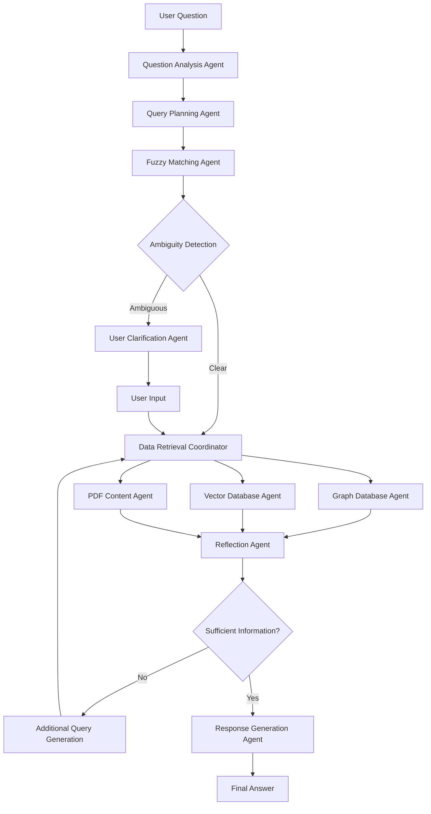

# CiteWeave - Advanced Citation Analysis System


[🇨🇳 点击查看中文文档 (README.zh.md)](README.zh.md)

> **This project is licensed under the Apache License 2.0. See the LICENSE file for details.**

---

## Who is CiteWeave for?

- **Social science researchers** seeking advanced tools for literature review, citation network analysis, and argument mapping. (e.g. Political Science, Sociology, Economics, etc.). Since the system is designed to work with social science papers, the whole workflow might not be suitable for other fields. However, if you are in other fields and find it useful, please let us know!
- **Academic researchers** in any field who want to build a semantic, searchable database of papers and citations.
- **Anyone** needing argument-level (sentence-level) citation relationships between papers for deep research, knowledge graph construction, or retrieval-augmented generation (RAG) applications.

---

## 🚀 Project Overview

CiteWeave helps you truly understand your research papers by:
- Showing you not just which papers cite each other, but exactly **which arguments or sentences are being cited**—so you can trace the flow of ideas.
- Letting you **chat with your PDF library**: ask complex research questions and get clear, structured answers with aggregated information.
- Building a unique, argument-level citation network—perfect for deep literature reviews and discovering new connections.
- Making it easy for social science researchers (and beyond) to organize, search, and map out the debates in their field.
- All through a simple command-line interface (with a GUI coming soon).

---

## ⭐ Key Features & Architecture

- **Multi-Agent System**: CiteWeave uses a modular, multi-agent architecture for research question analysis, query planning, fuzzy matching, user clarification, data retrieval, reflection, and response generation.
- **Argument-Level Citation Graph**: CiteWeave is the **first open-source project** to build argument-level (sentence-level) citation relationships between papers. This means you can analyze not just which papers cite each other, but exactly **which arguments, claims, or sentences** are cited and how they connect across the literature.
- **Other Features**:
  - Enables advanced literature review, argument mapping, and citation network analysis at a much deeper level than traditional tools.
  - Ideal for social science and interdisciplinary research where understanding the flow of arguments and evidence is critical.
  - Supports semantic search, RAG, and knowledge graph applications for academic PDFs.

### Multi-Agent System Architecture



---

## ⚡ Quick Start: Set Up All Services

1. **Set Up Your Python Environment**
   - Python 3.12 is recommended.
   - Install dependencies: `pip install -r requirements.txt`.
   - **First-time only:** Download the NLTK punkt tokenizer (required for sentence splitting):
     ```bash
     python -m nltk.downloader punkt
     ```

2. **Configure Environment Variables**
   - Copy the template: `cp .env_template .env`
   - Edit `.env` and fill in your OpenAI API key, Neo4j password, etc.

3. **Start All Core Services (Qdrant, GROBID, Neo4j)**
   - Download docker desktop if you don't have it already. (https://www.docker.com/products/docker-desktop/)
   - Download docker compose if you don't have it already. (https://docs.docker.com/compose/install/)
   - Run:
     ```bash
     docker-compose up -d
     ```

     To check if the services are running, run:
     ```bash
     python scripts/start_services.py
     ```

4. **Wait for Services to Be Ready**
   - Once you see the service URLs, you're ready to use CiteWeave!

> **Note:** These services must be running before using the CLI to upload PDFs or ask research questions.

---

## 🖥️ CLI Usage (All User Interaction)

**Workflow Summary:**
1. **Upload your PDF files** (required, provides the data for all research and chat)
   - Use `upload` for a single file, or `batch-upload` for all PDFs in a directory
2. **(Optional) Diagnose PDF quality** before upload
3. **Chat with the multi-agent system** to ask research questions about your uploaded documents

All user interaction is via the CLI. Do not use Python APIs or import functions directly.

### 1. Upload and Process PDF Documents (**First Step, Required**)

Before you can chat or ask any research questions, you must upload and process your PDF files. This populates the system with the data needed for analysis and chat.

**Single file upload:**
```bash
python -m src.core.cli upload path/to/your/file.pdf
```
- Add `--diagnose` to run a quality check before processing.
- Add `--force` to force reprocessing even if cached results exist.

**Example:**
```
python -m src.core.cli upload test_files/Porter\ -\ Competitive\ Strategy.pdf --diagnose
```

**Batch upload (process all PDFs in a directory):**
```bash
python -m src.core.cli batch-upload path/to/your/pdf_folder
```
- This will recursively find and process all `.pdf` files in the specified directory and its subdirectories.
- Progress and a summary of successes/failures will be printed.

If you are using Zotero, you can use the following command to upload all of your Paper Collection. This allow you to ask questions about all of your papers:

```bash
python -m src.core.cli batch-upload /path/to/zotero/library --processors 8
```


**Multiprocessing Batch Upload (Recommended for large batches):**
```bash
# Default multiprocessing (4 processors)
python -m src.core.cli batch-upload path/to/your/pdf_folder

# Custom number of processors
python -m src.core.cli batch-upload path/to/your/pdf_folder --processors 8

# Sequential processing (original behavior, useful for debugging)
python -m src.core.cli batch-upload path/to/your/pdf_folder --sequential
```

**Resume Batch Upload (Handles interruptions):**
```bash
# Resume from previous progress (default behavior)
python -m src.core.cli batch-upload path/to/your/pdf_folder

# Explicit resume mode
python -m src.core.cli batch-upload path/to/your/pdf_folder --resume

# Force restart (ignore previous progress)
python -m src.core.cli batch-upload path/to/your/pdf_folder --force-restart

# Clear progress and start fresh
python -m src.core.cli batch-upload path/to/your/pdf_folder --clear-progress

# Check progress status
python -m src.core.cli progress path/to/your/pdf_folder
```

**Performance Benefits:**
- **3-4x faster** for typical batches
- **Parallel processing** - utilizes multiple CPU cores
- **Real-time progress** - shows completion status as files finish
- **Error isolation** - individual failures don't stop the batch
- **Resume capability** - automatically continues from interruptions


### 2. Start an Interactive Research Chat (**After Uploading Files**)

Once you have uploaded and processed your PDFs, you can start a multi-turn chat session with the multi-agent research system:

```bash
python -m src.core.cli chat
```
- Type your research questions at the `You:` prompt.
- The AI will respond after each question, using the data from your uploaded files.
- Type `exit` or `quit` to end the chat session.

**Example:**
```
$ python -m src.core.cli chat
🤖 CiteWeave Multi-Agent Research System (Chat Mode)
============================================================
Type 'exit' or 'quit' to end the chat.
============================================================
You: What papers cite Porter's 1980 book?
AI: [answer]
You: exit
Exiting chat.
```


## 📄 PDF Processing & Quality Diagnosis

- **Processing**: The `upload` command will process the PDF, extract sentences, citations, and references, and store results in the data directory.
- **Diagnosis**: Use `--diagnose` or the `diagnose` command to check if a PDF is suitable for processing. The CLI will print quality level, processability, and recommendations.
- **Output**: After processing, you’ll see stats (total sentences, citations, references) and example sentences with citations.

---

## 💬 Citation Analysis & Research Chat

- **Start chat**: `python -m src.core.cli chat`
- **Ask questions**: e.g.,
  - "What papers cite Rivkin's work on strategy?"
  - "List all papers written by Michael Porter."
  - "What is the main idea of Porter's 1980 book?"
- **Supported queries**: Citation relationships, author papers, paper content, concept explanations, etc.
- **System response**: The AI will analyze your question, search the database, and return structured answers.

### Example Questions You Can Ask

You can ask a wide range of research questions, such as:

**Citation Queries:**
- "Which papers cite Porter's work on strategy?"
- "Who cited Porter's Competitive Strategy?"
- "Show me all papers that reference Rivkin's 2000 article."

**Author Queries:**
- "List all papers written by Michael Porter."
- "What are the main works of Rivkin?"
- "Which authors have collaborated with Porter?"

**Paper Content & Summaries:** (The paper should be uploaded first)
- "What is the main idea of Porter's 1980 book?"
- "Summarize the findings of Rivkin's 2000 article."
- "What are the key arguments in paper: Imitation of Complex Strategies?" 

**Concept & Topic Queries:**
- "Explain the concept of business model innovation."
- "What is the definition of competitive advantage?"
- "Which papers discuss imitation in strategy?"
- "How reputation is defined from different perspectives?"

**Find Papers by Content:**
- "Find the paper that organizations that suggest holding a high status may lead to feelings of insecurity."
- "Identify the paper that utilizes the results of LDA probability to assess the similarity description of Airbnb."
- "Find the paper that using IMDB dataset."


Feel free to experiment—if your question is related to the content of your uploaded PDFs, citation relationships, or academic concepts, the system will try to answer it! 

---

## 🛠️ Advanced Features

### Multiprocessing Batch Upload

For processing large numbers of PDF files, CiteWeave supports multiprocessing to significantly speed up batch operations:

**Key Features:**
- **Configurable processor count** - default 4, customizable via `--processors`
- **Automatic validation** - detects available CPU cores and adjusts accordingly
- **Real-time progress tracking** - shows completion status with ✅/❌ indicators
- **Comprehensive logging** - detailed START/FINISH messages for monitoring
- **Error isolation** - individual file failures don't affect other files

**Usage Examples:**
```bash
# Use all available CPU cores
python -m src.core.cli batch-upload /papers/ --processors $(nproc)

# Conservative processing (2 cores)
python -m src.core.cli batch-upload /papers/ --processors 2

# Debug mode with detailed error messages
python -m src.core.cli batch-upload /papers/ --sequential
```

**Performance Comparison:**
- **Sequential**: 10 files × 2 minutes = ~20 minutes
- **Multiprocessing (4 cores)**: ~5-6 minutes (**3-4x faster**)

### Resume Batch Upload

Automatically resume interrupted batch uploads with progress tracking:

**Key Features:**
- **Automatic resume** - continues from where it left off by default
- **Progress tracking** - stores status in `data/batch_upload_tracker.json`
- **Flexible control** - explicit resume, force restart, or clear progress
- **Progress monitoring** - view status with `progress` command
- **Error recovery** - handles interruptions gracefully

**Usage Examples:**
```bash
# Check current progress
python -m src.core.cli progress /papers/

# Resume interrupted upload
python -m src.core.cli batch-upload /papers/ --resume

# Force restart after fixing issues
python -m src.core.cli batch-upload /papers/ --force-restart

# Clear progress and start fresh
python -m src.core.cli progress /papers/ --clear
```

**Resume Scenarios:**
- **System shutdown** - automatically resumes on next run
- **Processing errors** - skips completed files, retries failed ones
- **Manual interruption** - continue from exact interruption point
- **File changes** - reprocess modified files with `--force-restart`

---

## ❓ Troubleshooting & FAQ

- **Missing dependencies?**
  - Make sure you’ve run `pip install -r requirements.txt` in your virtual environment.
- **PDF not processing well?**
  - Try `--diagnose` to see recommendations.
- **Database connection errors?**
  - Check your config files in `config/` for correct paths and credentials.
- **Chat/Research not working or AI errors?**
  - Make sure you have set your OpenAI API key as described above (`OPENAI_API_KEY`).
  - Check for typos or missing/expired keys.
  - Restart your terminal after setting the key.
- **Other issues?**
  - Check logs printed in the terminal for error messages.
  - For advanced help, see the `docs/` folder or open an issue on GitHub.
- **Batch upload issues?**
  - If multiprocessing fails, try `--sequential` flag for detailed error messages.
  - Reduce processor count if system becomes unresponsive: `--processors 2`
  - Monitor system resources during large batch processing.
- **Resume/interruption issues?**
  - Use `--force-restart` to reprocess all files after fixing issues.
  - Check progress with `python -m src.core.cli progress /your/directory/`
  - Clear progress with `--clear-progress` if tracking gets corrupted.
  - Progress is stored in `data/batch_upload_tracker.json` - delete to reset all progress.

---

## 📜 License

This project is licensed under the Apache License 2.0. See the LICENSE file for details.

---

## 🚧 Project Status & Feedback

CiteWeave is in an early stage of development and may have bugs or missing features. If you encounter any issues, please feel free to [open an issue](https://github.com/Tiresiasel/CiteWeave/issues) or submit a pull request. Your feedback and contributions are very welcome!

If you find this project interesting or want to collaborate, you can contact me directly (machespresso@gmail.com).