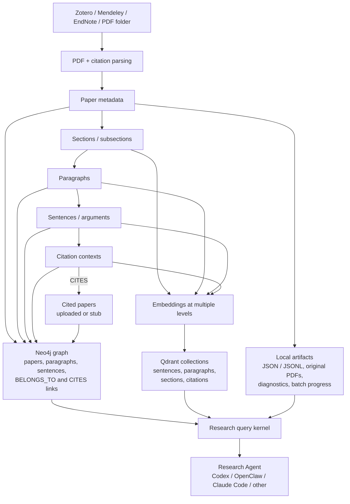

<p align="center">
  
</p>

# CiteWeave

**Personal literature retrieval for the papers you have read, collected, and cared about.**

[](LICENSE)

---

## Project Introduction

Literature search often begins with a half-memory: a sentence you once underlined, a citation you vaguely remember, a method you know someone used, or a debate you remember but cannot locate.

CiteWeave is a personal literature retrieval library for that kind of search.

It helps you find the paper hiding inside your own reading history, then rebuild the logic around it. CiteWeave parses your PDFs into structured scholarly units: papers, sections, paragraphs, sentences, citation contexts, and references. It stores citation relationships in Neo4j, semantic representations in Qdrant, and processed artifacts locally, so an agent can search by keyword, argument, citation context, and conceptual proximity.

CiteWeave searches inward across the literature you have read, collected, and cared about. It makes your personal research memory searchable: recover the exact argument, trace the citation path, and assemble a coherent scholarly line from your own corpus.

## Quick Start

This is an agent-based installation.

Copy or clone this GitHub repository, then ask your agent to install CiteWeave for you. The agent can be Codex, OpenClaw, Claude Code, or any other local shell-capable research agent.

Required before installation:

- **A shell-capable Research Agent**: Codex, OpenClaw, Claude Code, or another agent that can read this repo and run local commands.
- **Docker with Docker Compose**: CiteWeave runs Neo4j, Qdrant, and GROBID as local Docker services. Docker must be installed and running before installation starts.
- **Python 3.9+**: the installer uses `python3` to create the local virtual environment and install project dependencies.

Optional:

- **Git** if you want to clone the repository instead of downloading it.
- **An embedding API key** only if you choose API embeddings instead of local embeddings.
- **MinerU** only if you want the optional high-quality PDF-to-Markdown parser; the default parser stack works without it.

```text
Please install this project. Follow docs/agent/INSTALL.md.
```

If you are an agent, start here:

```text
docs/agent/INSTALL.md
```

The installation manual tells the agent what to ask, which configuration files to update, which services to start, and how to validate the installation. In practice, the agent will guide you through:

1. selecting the Research Agent mode;
2. choosing your literature source: Zotero, Mendeley, EndNote, PDF folder, or single PDF test;
3. choosing local or API embeddings;
4. starting Neo4j, Qdrant, and GROBID;
5. validating the source with a dry run;
6. beginning resumable ingestion and optional recurring sync.

For a direct local setup, the agent may apply choices with:

```bash
.venv/bin/python scripts/apply_install_choices.py \
  --research-agent Codex \
  --reference-manager zotero \
  --source-location-mode custom \
  --source-dir /path/to/Zotero \
  --embedding-mode local \
  --embedding-profile bge_large_en \
  --sync-schedule every_5_minutes \
  --processors 10 \
  --skip-failed
```

Then it will start services and validate the source:

```bash
bash scripts/bootstrap_local.sh
bash scripts/deployment_check.sh
.venv/bin/python scripts/sync_literature_pdfs.py \
  --source "$CITEWEAVE_LITERATURE_SOURCE_DIR" \
  --reference-manager "$CITEWEAVE_REFERENCE_MANAGER" \
  --dry-run \
  --json
```

After validation, it can run ingestion:

```bash
.venv/bin/python scripts/sync_literature_pdfs.py \
  --source "$CITEWEAVE_LITERATURE_SOURCE_DIR" \
  --reference-manager "$CITEWEAVE_REFERENCE_MANAGER" \
  --json \
  --processors 10 \
  --skip-failed
```

Ask a question:

```bash
.venv/bin/citeweave query "Which papers discuss competitive dynamics and platform strategy?"
```

## What You Can Ask

CiteWeave is designed for questions that begin inside your own library:

- **Recover a half-remembered argument**: “Which paper argued that platform competition changes firm-level strategic response?”
- **Trace a citation path**: “Who cites Teece 1997, and what are they using it for?”
- **Build a literature thread**: “Connect the papers in my library that move from resource-based view to dynamic capabilities.”
- **Construct a meta-analysis**: “Compare and contrast the findings on competitive aggressiveness in multi-market contexts.”
- **Inspect citation context**: “Where does this paper discuss competitive response, and which references appear in that paragraph?”
- **Find gaps in the library**: “Which cited papers are unresolved or missing PDFs?”

CiteWeave retrieves documents and reconstructs the argument trail you need for thinking, writing, and theorizing.

Any literature question you can formulate in natural language can be tried against this local database and retrieval system.

## What CiteWeave Builds

CiteWeave turns a PDF library into a structured local knowledge system:

- **paper-level records**: metadata, authors, year, DOI, venue, original PDF, and processed outputs;
- **section / subsection layers**: structural divisions of the paper and section-level embeddings;
- **paragraph layers**: paragraph text, containing section, citation counts, and broader citation context;
- **sentence layers**: sentence text, citation flags, claim / argument fields, and sentence embeddings;
- **citation layers**: in-text citation, reference entry, cited-paper id, citation context, and confidence.

Those layers are stored across complementary backends:

- **Neo4j** models the citation-and-context network: a paper contains sections, paragraphs, and sentences; citation-bearing sentences and paragraphs point to the papers they cite; unresolved references remain as stub papers, so you can trace a path from a remembered argument to the exact passage, the citing paper, and the cited lineage.
- **Qdrant** stores semantic indexes for `sentences`, `paragraphs`, `sections`, and `citations`.
- **Local artifacts** store inspectable JSON / JSONL outputs, original PDFs, diagnostics, and resumable ingestion progress.

This makes CiteWeave useful when the query is not a perfect keyword, but a remembered claim, a conceptual neighborhood, or a citation relationship.

## Architecture


```mermaid
flowchart TB
    Corpus["Zotero / Mendeley / EndNote / PDF folder"] --> Parse["PDF + citation parsing"]

    Parse --> Paper["Paper metadata"]
    Paper --> Section["Sections / subsections"]
    Section --> Paragraph["Paragraphs"]
    Paragraph --> Sentence["Sentences / arguments"]
    Sentence --> CiteCtx["Citation contexts"]
    CiteCtx -->|CITES| CitedPaper["Cited papers<br/>uploaded or stub"]

    Paper --> Artifact["Local artifacts<br/>JSON / JSONL, original PDFs,<br/>diagnostics, batch progress"]

    Paper --> Graph["Neo4j graph<br/>papers, paragraphs, sentences,<br/>BELONGS_TO and CITES links"]
    Paragraph --> Graph
    Sentence --> Graph
    CiteCtx --> Graph
    CitedPaper --> Graph

    Section --> Embedding["Embeddings at multiple levels"]
    Paragraph --> Embedding
    Sentence --> Embedding
    CiteCtx --> Embedding

    Embedding --> Vector["Qdrant collections<br/>sentences, paragraphs,<br/>sections, citations"]

    Graph --> Kernel["Research query kernel"]
    Vector --> Kernel
    Artifact --> Kernel

    Kernel --> Agent["Research Agent<br/>Codex / OpenClaw / Claude Code / other"]
```

The boundary is simple:

> The Research Agent decides what the user is trying to do. CiteWeave decides how local research evidence should be retrieved, checked, and assembled.

## Literature Sources

CiteWeave can recursively scan:

- Zotero data directories or `storage/` folders;
- Mendeley-managed PDF folders;
- EndNote library PDF folders;
- any ordinary PDF folder;
- a single PDF for a smoke test.

Generic sync:

```bash
.venv/bin/python scripts/sync_literature_pdfs.py \
  --source "$CITEWEAVE_LITERATURE_SOURCE_DIR" \
  --reference-manager "$CITEWEAVE_REFERENCE_MANAGER" \
  --json \
  --processors 10 \
  --skip-failed
```

Zotero compatibility remains available:

```bash
.venv/bin/python scripts/sync_zotero_pdfs.py --source /path/to/Zotero --json
```

## Tooling Stack

CiteWeave is local-first and database-backed:

- **PDF extraction**: GROBID, PyMuPDF / pdfplumber, and optional MinerU for PDF-to-Markdown extraction;
- **graph storage**: Neo4j for citation and containment relationships;
- **vector storage**: Qdrant for multi-level semantic retrieval;
- **embeddings**: local SentenceTransformers or OpenAI-compatible embedding APIs;
- **agent operation**: Codex, OpenClaw, Claude Code, or another shell-capable Research Agent;
- **research-writing fit**: processed JSON / JSONL and Markdown-friendly artifacts can sit next to Markdown, LaTeX, README, or Typeless-style writing workflows.

## Embeddings

Recommended local profile:

```env
CITEWEAVE_EMBEDDING_PROVIDER=local
CITEWEAVE_EMBEDDING_PROFILE=bge_large_en
CITEWEAVE_EMBEDDING_MODEL=BAAI/bge-large-en-v1.5
CITEWEAVE_EMBEDDING_DIMENSIONS=1024
```

Fast local trial:

```env
CITEWEAVE_EMBEDDING_PROVIDER=local
CITEWEAVE_EMBEDDING_PROFILE=mini_l6_compat
CITEWEAVE_EMBEDDING_MODEL=all-MiniLM-L6-v2
CITEWEAVE_EMBEDDING_DIMENSIONS=384
```

OpenAI:

```env
CITEWEAVE_EMBEDDING_PROVIDER=openai
CITEWEAVE_EMBEDDING_MODEL=text-embedding-3-small
CITEWEAVE_EMBEDDING_DIMENSIONS=1536
CITEWEAVE_EMBEDDING_API_KEY=...
```

Important rule:

> Changing the embedding provider, model, or dimensions requires a full vector rebuild and full corpus re-ingest.

Do not resume old ingestion progress after an embedding change. Old vectors live in a different embedding space, even when dimensions happen to match.

## Operations

Start local services:

```bash
bash scripts/deploy_local_stack.sh
bash scripts/deployment_check.sh
```

Upload or diagnose one PDF:

```bash
.venv/bin/citeweave upload ./papers/example.pdf
.venv/bin/citeweave diagnose ./papers/example.pdf
```

Inspect health and progress:

```bash
.venv/bin/citeweave health --json
.venv/bin/citeweave routes --json
.venv/bin/citeweave progress /path/to/pdf/source --json
.venv/bin/citeweave list_pending_citations --json
```

## Documentation

- [`docs/agent/README.md`](docs/agent/README.md) — generic agent template overview;
- [`docs/agent/INSTALL.md`](docs/agent/INSTALL.md) — AI-facing installation protocol;
- [`docs/agent/install_manifest.yaml`](docs/agent/install_manifest.yaml) — machine-readable installation manifest;
- [`docs/agent/DEPLOYMENT.md`](docs/agent/DEPLOYMENT.md) — generic local deployment guide for any Research Agent;
- [`docs/agent/OPERATING_CONTRACT.md`](docs/agent/OPERATING_CONTRACT.md) — generic agent operating contract;
- [`docs/KERNEL_AND_ADAPTERS.md`](docs/KERNEL_AND_ADAPTERS.md) — kernel / adapter architecture;
- [`docs/agent/openclaw/README.md`](docs/agent/openclaw/README.md) — OpenClaw runtime notes;
- [`docs/data_structures/README.md`](docs/data_structures/README.md) — graph and vector data model;
- [`docs/mineru_usage.md`](docs/mineru_usage.md) — optional MinerU parsing notes.

Chinese overview: [`README.zh.md`](README.zh.md).


## License

Apache License 2.0. See [LICENSE](LICENSE).
