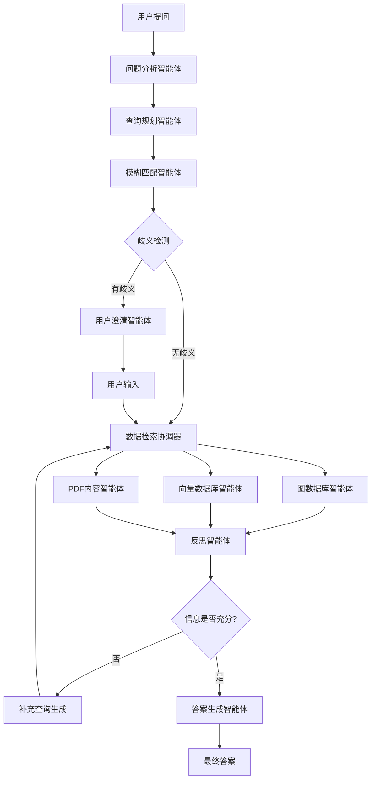

# CiteWeave - 高级学术引用分析系统


[🇺🇸 Switch to English README](README.md)

> **本项目遵循 Apache License 2.0 许可证。详情见 LICENSE 文件。**

---

## 适用人群

- **社会科学研究者**：需要进行文献综述、引用网络分析和论点映射的高级工具（如政治学、社会学、经济学等）。本系统主要针对社会科学论文，但其他领域如有兴趣也欢迎使用！
- **各领域学者**：希望构建可语义检索的论文与引用数据库。
- **需要句子级引用关系的研究者**：适用于深度研究、知识图谱构建或RAG应用。

---

## 🚀 项目简介

CiteWeave 帮助你真正理解学术论文：
- 不仅展示论文之间的引用关系，还能精确到**被引用的论点或句子**，追踪思想流动。
- 支持**与PDF库对话**：可提出复杂学术问题，获得结构化、聚合的信息答案。
- 构建独特的句子级（argument-level）引用网络，适合深度文献综述和发现新关联。
- 让社会科学及跨学科研究者轻松梳理、检索和可视化学术争论。
- 目前为命令行界面（CLI），未来将支持图形界面（GUI）。

---

## ⭐ 主要特性与架构

- **多智能体系统**：采用模块化多智能体架构，涵盖问题分析、查询规划、模糊匹配、用户澄清、数据检索、反思与答案生成。
- **句子级引用图谱**：首个开源项目实现句子级（argument-level）引用关系，支持跨论文追踪论点、证据和引用链条。
- **其他亮点**：
  - 支持高级文献综述、论点映射和深层引用网络分析。
  - 适合社会科学及需要理解论证流的跨学科研究。
  - 支持语义检索、RAG、知识图谱等学术PDF应用。

### 多智能体系统架构



---

## ⚡ 快速开始：环境搭建

1. **配置Python环境**
   - 推荐 Python 3.12。
   - 安装依赖：`pip install -r requirements.txt`
   - **首次使用**：下载 NLTK punkt 分词器（用于句子切分）：
     ```bash
     python -m nltk.downloader punkt
     ```

2. **配置环境变量**
   - 复制模板：`cp .env_template .env`
   - 编辑 `.env`，填写 OpenAI API Key、Neo4j 密码等信息。

3. **启动核心服务（Qdrant, GROBID, Neo4j）**
   - 未安装 Docker Desktop 请先下载：https://www.docker.com/products/docker-desktop/
   - 未安装 Docker Compose 请先下载：https://docs.docker.com/compose/install/
   - 启动服务：
     ```bash
     docker-compose up -d
     ```

     检查服务状态：
     ```bash
     python scripts/start_services.py
     ```

4. **等待服务就绪**
   - 看到服务URL后即可使用 CiteWeave！

> **注意：** 必须先启动这些服务，才能用CLI上传PDF或提问。

---

## 🖥️ CLI 用法（所有交互均通过命令行）

**工作流程概览：**
1. **上传PDF文件**（必需，提供数据基础）
   - 单文件用 `upload`，批量用 `batch-upload`
2. **（可选）诊断PDF质量**
3. **与多智能体系统对话**，提出学术问题

所有交互均通过CLI完成。请勿直接调用Python API或导入函数。

### 1. 上传与处理PDF（第一步，必需）

上传并处理PDF后，系统才有数据可用于分析和对话。

**单文件上传：**
```bash
python -m src.core.cli upload 路径/文件.pdf
```
- 加 `--diagnose` 可先做质量检查。
- 加 `--force` 可强制重新处理。

**示例：**
```
python -m src.core.cli upload test_files/Porter\ -\ Competitive\ Strategy.pdf --diagnose
```

**批量上传（处理目录下所有PDF）：**
```bash
python -m src.core.cli batch-upload 路径/pdf文件夹
```
- 会递归处理目录及子目录下所有 `.pdf` 文件。
- 处理进度和结果会在终端显示。

如果你使用 Zotero，可以用以下命令上传所有论文，便于后续提问：

```bash
python -m src.core.cli batch-upload /path/to/zotero/library --processors 8
```

**多进程批量上传（推荐大批量处理）：**
```bash
# 默认4进程
python -m src.core.cli batch-upload 路径/pdf文件夹

# 自定义进程数
python -m src.core.cli batch-upload 路径/pdf文件夹 --processors 8

# 顺序处理（调试用）
python -m src.core.cli batch-upload 路径/pdf文件夹 --sequential
```

**断点续传（处理中断时使用）：**
```bash
# 默认自动续传
python -m src.core.cli batch-upload 路径/pdf文件夹

# 显式续传
python -m src.core.cli batch-upload 路径/pdf文件夹 --resume

# 强制重头处理
python -m src.core.cli batch-upload 路径/pdf文件夹 --force-restart

# 清除进度重新开始
python -m src.core.cli batch-upload 路径/pdf文件夹 --clear-progress

# 查看进度
python -m src.core.cli progress 路径/pdf文件夹
```

**性能优势：**
- **3-4倍加速**
- **实时进度**
- **错误隔离**
- **断点续传**


### 2. 启动交互式学术对话（上传后）

上传并处理PDF后，可启动多轮对话：

```bash
python -m src.core.cli chat
```
- 在 `You:` 提示符下输入问题。
- AI会基于已上传文件回答。
- 输入 `exit` 或 `quit` 结束对话。

**示例：**
```
$ python -m src.core.cli chat
🤖 CiteWeave 多智能体学术系统（对话模式）
============================================================
输入 'exit' 或 'quit' 退出。
============================================================
You: 哪些论文引用了Porter的1980年著作？
AI: [答案]
You: exit
Exiting chat.
```


## 📄 PDF处理与质量诊断

- **处理**：`upload` 命令会提取句子、引用、参考文献，并将结果存储到数据目录。
- **诊断**：用 `--diagnose` 或 `diagnose` 命令检查PDF是否适合处理，CLI会输出质量等级、可处理性和建议。
- **输出**：处理后会显示统计信息（句子数、引用数、参考文献数）及引用示例。

---

## 💬 引用分析与学术对话

- **启动对话**：`python -m src.core.cli chat`
- **可提问示例**：
  - “哪些论文引用了Rivkin的战略研究？”
  - “列出Michael Porter写的所有论文。”
  - “Porter 1980年著作的主要观点是什么？”
- **支持查询**：引用关系、作者论文、论文内容、概念解释等。
- **系统响应**：AI会分析问题，检索数据库，返回结构化答案。

### 可提问示例

你可以提出各种学术问题，例如：

**引用查询：**
- “哪些论文引用了Porter的战略理论？”
- “谁引用了Porter的《竞争战略》？”
- “列出所有引用Rivkin 2000年文章的论文。”


**作者查询：**
- “列出Michael Porter写的所有论文。”
- “Rivkin的主要著作有哪些？”
- “Porter与哪些作者合作过？”

**论文内容与摘要：**（需先上传论文）
- “Porter 1980年著作的主要观点是什么？”
- “总结Rivkin 2000年文章的发现。”
- “Imitation of Complex Strategies 这篇论文的核心论点是什么？”

**概念与主题查询：**
- “解释 business model innovation 的概念。”
- “什么是 competitive advantage？”
- “哪些论文讨论了战略模仿？”

欢迎自由提问——只要与你上传的PDF内容、引用关系或学术概念相关，系统都会尝试回答！

---

## 🛠️ 高级功能

### 多进程批量上传

处理大量PDF时，CiteWeave支持多进程批量处理，大幅提升效率：

**主要特性：**
- **可配置进程数**（默认4，可用 `--processors` 指定）
- **自动检测CPU核心数**
- **实时进度追踪**（✅/❌）
- **详细日志**（START/FINISH）
- **错误隔离**（单文件失败不影响整体）

**用法示例：**
```bash
# 使用所有CPU核心
python -m src.core.cli batch-upload /papers/ --processors $(nproc)

# 保守处理（2核）
python -m src.core.cli batch-upload /papers/ --processors 2

# 调试模式（详细错误信息）
python -m src.core.cli batch-upload /papers/ --sequential
```

**性能对比：**
- **顺序处理**：10个文件 × 2分钟 ≈ 20分钟
- **多进程（4核）**：约5-6分钟（**3-4倍加速**）

### 断点续传

批量上传中断时可自动续传：

**主要特性：**
- **自动续传**（默认）
- **进度追踪**（`data/batch_upload_tracker.json`）
- **灵活控制**（显式续传、强制重头、清除进度）
- **进度监控**（`progress` 命令）
- **错误恢复**（中断可恢复）

**用法示例：**
```bash
# 查看进度
python -m src.core.cli progress /papers/

# 续传
python -m src.core.cli batch-upload /papers/ --resume

# 修复后强制重头
python -m src.core.cli batch-upload /papers/ --force-restart

# 清除进度重新开始
python -m src.core.cli progress /papers/ --clear
```

**续传场景：**
- **系统关机** - 下次自动续传
- **处理错误** - 跳过已完成，重试失败
- **手动中断** - 从中断点继续
- **文件变更** - 用 `--force-restart` 重新处理

---

## ❓ 常见问题与FAQ

- **依赖缺失？**
  - 请确保已在虚拟环境中运行 `pip install -r requirements.txt`。
- **PDF处理效果不好？**
  - 试试 `--diagnose` 查看建议。
- **数据库连接错误？**
  - 检查 `config/` 下的配置文件路径和凭据。
- **对话/AI功能异常？**
  - 请确保已设置 OpenAI API Key（`OPENAI_API_KEY`）。
  - 检查密钥是否正确、未过期。
  - 设置后重启终端。
- **其他问题？**
  - 查看终端日志。
  - 进阶帮助见 `docs/` 文件夹，或在 GitHub 提 issue。
- **批量上传问题？**
  - 多进程失败时可用 `--sequential` 查看详细错误。
  - 系统卡顿可降低进程数：`--processors 2`
  - 大批量处理时注意系统资源。
- **续传/中断问题？**
  - 修复后用 `--force-restart` 重新处理。
  - 用 `python -m src.core.cli progress /your/directory/` 查看进度。
  - 用 `--clear-progress` 清除进度。
  - 进度存储在 `data/batch_upload_tracker.json`，可删除重置。

---

## 📜 许可证

本项目遵循 Apache License 2.0 许可证。详情见 LICENSE 文件。

---

## 🚧 项目状态与反馈

CiteWeave 仍处于早期开发阶段，可能存在bug或功能不全。如遇到问题，欢迎[提交 issue](https://github.com/Tiresiasel/CiteWeave/issues)或PR，您的反馈和贡献非常宝贵！

如果你觉得本项目有趣或希望合作，欢迎直接联系我 (machespresso@gmail.com)。