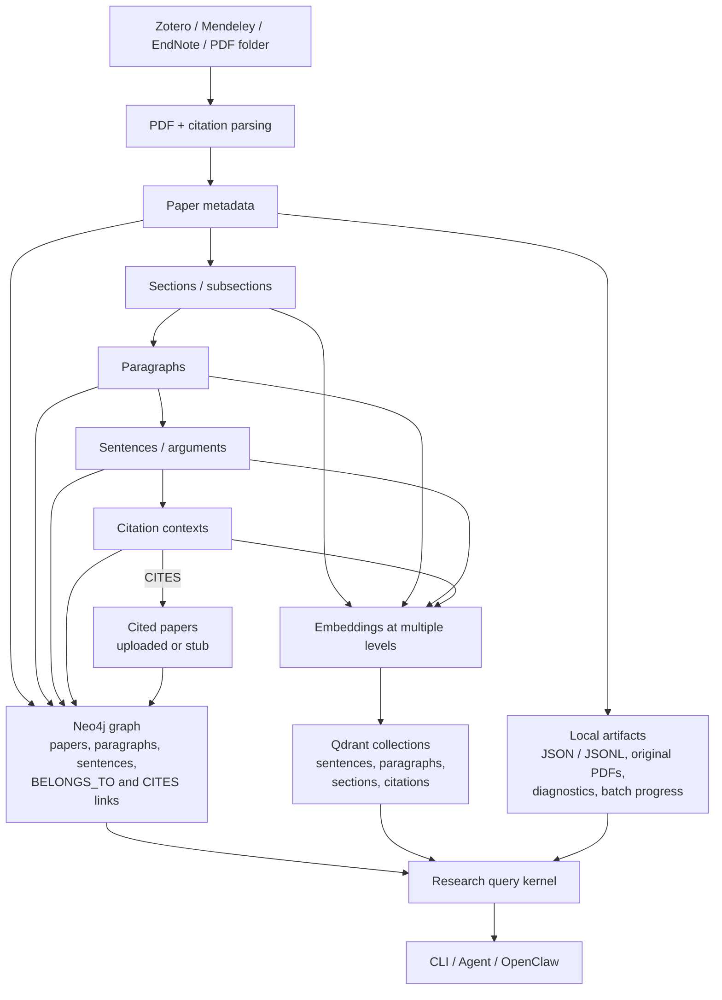

<p align="center">
  
</p>

# CiteWeave

**把 Zotero、Mendeley、EndNote 或普通 PDF 文献库变成一套本地、可查询的论文知识结构。**

学术 PDF 的研究价值来自多层次结构：句子里的 argument、段落里的论证展开、section / subsection 的主题组织、正文引用的上下文，以及论文之间的引用关系。CiteWeave 把这些结构从 PDF 中抽取出来，组织成一套本地知识结构，让用户可以围绕自己的文献库进行检索和追踪。

CiteWeave 是一个面向文献研究的本地 kernel：负责 PDF 解析、引文分析、图谱构建、向量索引、查询路由和证据综合。Agent、OpenClaw 或 CLI 提供操作入口；研究数据结构由 CiteWeave 维护。

[](LICENSE)

---

## 这个项目做了什么

CiteWeave 会导入 Zotero、Mendeley、EndNote 文献库或普通 PDF 文件夹，然后把每篇论文拆成多层次内容单元：

- **论文层面**：标题、作者、年份、DOI、期刊、原始 PDF 和处理结果；
- **section / subsection 层面**：论文结构、主题区块、章节级文本和章节向量；
- **段落层面**：段落文本、所在章节、引用数量、段落级 citation context；
- **句子层面**：句子文本、是否包含引用、argument / claim 类型字段、句子级向量；
- **引用层面**：正文引用、参考文献条目、被引论文、引用上下文和置信度。

这些结构会被同时写入几类本地存储：

- **Neo4j**：保存 paper、paragraph、sentence 等节点，以及 `BELONGS_TO` / `CITES` 等关系，适合回答“谁引用了谁”“在哪一句引用”“引用网络是什么”；
- **Qdrant**：为 sentences、paragraphs、sections、citations 建立 embedding collection，适合做语义检索和跨论文内容发现；
- **本地 artifacts**：保存 JSON / JSONL、原始 PDF、诊断信息和可恢复的批处理进度。

CiteWeave 的核心目标是把一个文献库整理成可以被计算、检索和追踪的学术知识结构。

---

## 它怎么工作

下面这张图是 README 里最重要的示意图：它展示了一篇篇 PDF 如何变成可查询的文献知识结构。


```mermaid
flowchart TB
    Corpus["Zotero / Mendeley / EndNote / PDF folder"] --> Parse["PDF + citation parsing"]

    Parse --> Paper["Paper metadata"]
    Paper --> Section["Sections / subsections"]
    Section --> Paragraph["Paragraphs"]
    Paragraph --> Sentence["Sentences / arguments"]
    Sentence --> CiteCtx["Citation contexts"]
    CiteCtx -->|CITES| CitedPaper["Cited papers<br/>uploaded or stub"]

    Paper --> Artifact["Local artifacts<br/>JSON / JSONL, original PDFs,<br/>diagnostics, batch progress"]

    Paper --> Graph["Neo4j graph<br/>papers, paragraphs, sentences,<br/>BELONGS_TO and CITES links"]
    Paragraph --> Graph
    Sentence --> Graph
    CiteCtx --> Graph
    CitedPaper --> Graph

    Section --> Embedding["Embeddings at multiple levels"]
    Paragraph --> Embedding
    Sentence --> Embedding
    CiteCtx --> Embedding

    Embedding --> Vector["Qdrant collections<br/>sentences, paragraphs,<br/>sections, citations"]

    Graph --> Kernel["Research query kernel"]
    Vector --> Kernel
    Artifact --> Kernel

    Kernel --> Interface["CLI / Agent / OpenClaw"]
```

这张图可以这样读：

1. 左边是原始语料：Zotero、Mendeley、EndNote library 或普通 PDF 文件夹。
2. PDF parser 先把论文拆成结构化层级：paper、section / subsection、paragraph、sentence。
3. citation parser 再把正文里的 `Porter (1980)` 这类引用，和 reference list 中的真实文献条目对应起来；如果被引论文还没有上传，就先在图谱里形成 stub paper。
4. section、paragraph、sentence 和 citation context 都会生成 embedding，进入 Qdrant 的多层级向量集合。
5. Neo4j 保存精确层级关系和引用关系，Qdrant 保存语义相似度检索能力，本地 artifacts 保留可复查的处理结果。
6. research query kernel 根据问题选择路线：查句子级 argument 时走 sentence vector、claim / argument 字段和 citation context；查论文引用关系时走 Neo4j；查一个研究主题的发展脉络时，把时间、引用关系和语义内容一起组合起来。

最终，用户面对的是一个已经按论文结构、引用关系和语义 embedding 组织好的文献系统。

---

## 能查询什么

CiteWeave 的查询能力围绕这套知识结构展开。典型问题包括：

- **句子层面的 argument**：找出某个理论、概念或方法相关的具体句子，并结合可用的 claim / citation-intent 标签判断它更像 main claim、evidence、method、limitation，还是 citation-based argument。
- **论文引用关系**：查询哪些论文引用了某篇论文、在哪些句子或段落中引用、引用时是在支持、使用方法、比较结果，还是作为背景。
- **段落和章节层面的讨论**：从更宽的上下文里看一个概念在某篇论文或一组论文中如何被展开。
- **整个文献的发展脉络**：结合年份、引用网络和语义检索，追踪一个理论、方法或研究问题如何被提出、延展、批评和迁移。
- **文献库维护**：发现 unresolved references、缺失 PDF、重复处理、批量导入进度和索引健康状态。

比如你可以问：

- “哪些论文继承了 Teece 1997？它们具体怎么用的？”
- “找一下 multimarket competition 的文献，并总结主要理论分歧。”
- “比较 multi-market context 中关于 competitive aggressiveness 的研究发现，并整理它们的共识和分歧。”
- “这篇论文讨论 competitive response 的时候引用了谁？”
- “我的文献库里有哪些 unresolved references 还缺 PDF？”

CiteWeave 让文献问题可以直接面向你的本地文献库提出。任何你能用自然语言描述的研究问题，都可以先交给这套数据库和检索方案尝试。

---

## Agent 在这里扮演什么角色

CiteWeave 可以被任何具备本地命令执行能力的 Agent 操作。Codex、OpenClaw、Claude Code、其他本地 Agent，或者人工 CLI，都可以把 CiteWeave 当成本地研究基础设施来调度。OpenClaw 是其中一个 adapter。

Agent 负责对话入口和运维循环：部署检查、Zotero 同步调度、上传请求、进度监控、诊断，以及用户提出的研究问题。

CiteWeave 负责真正的研究机器：导入、抽取、引文分析、图数据库/向量数据库存储，以及最终回答综合。

一个好记的边界是：

> Agent 判断用户想做什么；CiteWeave 判断研究证据应该怎么找。

对于普通研究问题，Agent 可以调用 CiteWeave facade，也可以组织本地 artifact、Neo4j、Qdrant 和 CLI 的结果。CiteWeave 是带有 ingestion、索引和证据路由边界的本地研究内核。

```python
facade.query("Which papers discuss platform competition?", confirmation="continue")
```

---

## 可以拿它做什么

### 持续索引文献库

把 CiteWeave 指向 Zotero、Mendeley、EndNote 或普通 PDF 目录，它会递归发现 PDF，处理它们，并跟踪可恢复进度。

```env
CITEWEAVE_LITERATURE_SOURCE_DIR=/path/to/library-or-pdf-folder
CITEWEAVE_REFERENCE_MANAGER=zotero
```

```bash
.venv/bin/python scripts/sync_literature_pdfs.py --source "$CITEWEAVE_LITERATURE_SOURCE_DIR" --json
```

### 上传或诊断单篇 PDF

```bash
.venv/bin/citeweave upload ./papers/example.pdf
.venv/bin/citeweave diagnose ./papers/example.pdf
```

### 提研究问题

```bash
.venv/bin/citeweave query "Which papers discuss competitive dynamics and platform strategy?"
```

### 查看导入进度

```bash
.venv/bin/citeweave progress /path/to/Zotero/storage
```

---

## 本地基础设施

典型本地部署会用 Docker Compose 拉起：

- **Neo4j** — 引文图谱和结构化研究实体；
- **Qdrant** — 语义向量检索；
- **GROBID** — 学术 PDF 元数据和参考文献抽取。

如果你让 Agent 帮你安装，建议让它遵循英文协议 [`docs/agent/INSTALL.md`](docs/agent/INSTALL.md)：该文档是写给正在执行安装的 AI 看的，明确规定 AI 应该问什么、写入哪些配置、运行哪些命令、如何验证结果。通用部署细节见 [`docs/agent/DEPLOYMENT.md`](docs/agent/DEPLOYMENT.md)。简版流程：

```bash
bash scripts/deploy_local_stack.sh
bash scripts/deployment_check.sh
.venv/bin/python scripts/sync_literature_pdfs.py --dry-run --json
```

除非你在排查问题，否则不要手动拼这些服务。未来的你已经够忙了，别再给他留谜题。

---

## Embeddings 与向量重建

CiteWeave 支持本地 SentenceTransformers embedding，也支持 OpenAI-compatible embedding provider。当前本地配置可以通过 `config/qdrant_config.json` 和环境变量选择，例如：

```env
CITEWEAVE_EMBEDDING_PROVIDER=local
CITEWEAVE_EMBEDDING_PROFILE=bge_large_en
CITEWEAVE_EMBEDDING_DEVICE=auto
```

重要规则：

> 只要更换基础 embedding model、provider 或 vector dimension，就必须重建向量索引并全量重跑语料。

不要在换 embedding 后继续沿用旧 progress 做 `--resume`。旧向量属于旧 embedding space。即使两个模型输出的维度碰巧一样，它们的距离也不能比较。把它们混进同一个 Qdrant collection，会让检索结果以一种很安静、很昂贵的方式坏掉。

正确流程：

1. 停止正在运行的 ingest。
2. 更新并确认 embedding 配置。
3. 重建或迁移 Qdrant collections。
4. 清空受影响数据源的 batch progress。
5. 从头全量 re-ingest。
6. 跑代表性查询，确认索引可信。

更多细节见 [`docs/agent/DEPLOYMENT.md#8-embedding-rebuild-rule`](docs/agent/DEPLOYMENT.md#8-embedding-rebuild-rule)。

---

## 文档

- [`docs/agent/README.md`](docs/agent/README.md) — 通用智能体模板总览；
- [`docs/agent/INSTALL.md`](docs/agent/INSTALL.md) — 面向 AI 的英文安装协议；
- [`docs/agent/install_manifest.yaml`](docs/agent/install_manifest.yaml) — 机器可读的安装选项、配置写入和验证项；
- [`docs/agent/DEPLOYMENT.md`](docs/agent/DEPLOYMENT.md) — 面向任意 Research Agent 的通用本地部署指南；
- [`docs/agent/OPERATING_CONTRACT.md`](docs/agent/OPERATING_CONTRACT.md) — 通用 Agent 运行契约；
- [`docs/agent/INSTALL.zh.md`](docs/agent/INSTALL.zh.md) — 中文 Agent 安装说明；
- [`docs/KERNEL_AND_ADAPTERS.md`](docs/KERNEL_AND_ADAPTERS.md) — kernel / adapters 架构；
- [`docs/agent/openclaw/README.md`](docs/agent/openclaw/README.md) — OpenClaw 运行时说明；
- [`docs/data_structures/README.md`](docs/data_structures/README.md) — 图谱和向量数据模型。

English overview: [`README.md`](README.md)。

---

## 开发

push 前常用门禁：

```bash
.venv/bin/python -m ruff check src tests scripts/sync_zotero_pdfs.py
.venv/bin/python -m ruff check tests/manual --select F --ignore E501
python3 -m compileall -q src tests scripts/sync_zotero_pdfs.py
.venv/bin/python -m pytest -q
python3 scripts/repo_privacy_audit.py
```

期望隐私审计结果：

```text
PRIVACY_AUDIT_OK
```

---

## License

Apache License 2.0 — see [LICENSE](LICENSE).
