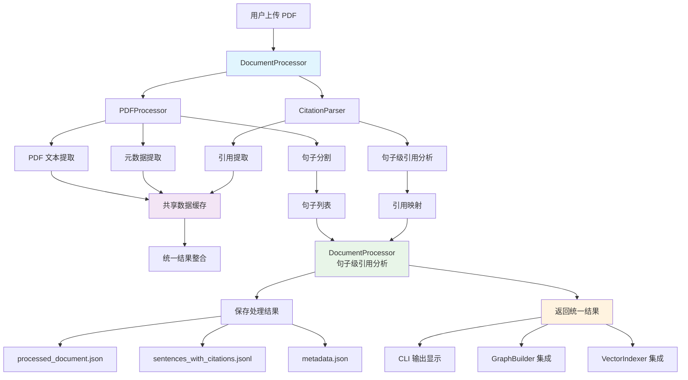

# 产品需求文档（PRD）

**项目名称：** Argument-Level Citation Graph + RAG 智能交互系统  
**版本：** v0.6  
**负责人：** Yinji Zhou  
**创建时间：** 2025-07-14（更新于 v0.6）

---

## 一、项目目标

构建一个能够支持细粒度论文引用分析的系统：以 "argument-level" 为单位组织和表示论文中的推理链条（如 claim、evidence、mechanism、causal statement），并结合知识图谱和语义检索，实现学术问答、引用路径分析和长期记忆支持。

该系统将集成 Neo4j 作为结构化图数据库，LlamaIndex 作为嵌入式语义索引层，LangChain 作为语言模型交互中间件，并可选接入 MemGPT 作为 memory agent。系统支持 PDF 上传后自动抽取信息，构建 argument 结构与引用边；支持引用延迟补全机制。

---

## 二、核心功能需求

### 1. 用户交互逻辑与数据流

#### 1.1 交互方式

- 用户通过命令行上传单篇论文 PDF 文件：如 `upload_paper ./path/to/PaperA.pdf`
- 系统读取并解析 PDF，提取文本段落、结构、metadata（title, authors, year）
- 系统抽取：
  - 本文内所有 argument/claim/证据单元
  - 本文引用的句子 + 被引用的目标（如文中出现 “see Smith 2022”）
- 输出：构建 `:Paper` 节点、若干 `:Argument` 节点、并建立 `:CITES` 边（如需，创建 `stub` 目标）

#### 1.2 延迟引用补全逻辑

- 若引用目标论文尚未上传，创建 `:Paper {stub: true}` 占位节点
- 引用边标记为 `status: "pending"`
- 后续上传引用源文件后，自动解析并补全边，更新为 `status: "resolved"`

#### 1.3 数据流处理逻辑（详细）

1. 用户上传 PDF
2. 使用 LLM (GPT-4/Claude) 对 PDF 分段与句子级处理
3. 判断每句类型：
   - 是否为 argument（claim-like 单位）
   - 若是 → 标注 `claim_type`
   - 若否 → 标记为 `NON_ARGUMENT`
4. 构建结构化 `:Argument` 节点
5. 检测引用语句（LLM+正则）
6. 判断引用对象是否已存在，建立 `CITES` 边或 stub
7. 写入图数据库和嵌入索引库

---

## 三、Argument 类型与关系类型

### 3.1 Argument `claim_type` 分类（可扩展）

| `claim_type`             | 描述                             |
|--------------------------|----------------------------------|
| `CLAIM_MAIN`             | 主张性主论点                    |
| `CLAIM_SUPPORTING`       | 次级支持性主张                  |
| `EVIDENCE_EMPIRICAL`     | 实证数据或结论支持              |
| `EVIDENCE_THEORETICAL`   | 理论逻辑或模型支持              |
| `EVIDENCE_LITERATURE`    | 引用他人文献支持                |
| `COUNTERARGUMENT`        | 反方观点、假设                  |
| `CONTEXT_LIMITATION`     | 范围、边界条件限制              |
| `METHODOLOGY`            | 方法说明                        |
| `ASSUMPTION`             | 模型设定或基础假设              |
| `REBUTTAL`               | 明确反驳其他研究观点            |
| `QUESTION_MOTIVATION`    | 提出研究问题或动机              |
| `FUTURE_WORK`            | 提出未来研究建议                |
| `NEUTRAL`                | 无立场句                         |
| `NON_ARGUMENT`           | 无需建图的普通句（说明、过渡）  |

> 扩展机制：
> - 所有 claim_type 保存在 `claim_types.yaml` 或 Neo4j `:ClaimTypeSchema`
> - Argument 节点应包含字段：`claim_type_version`, `custom_tags`, `confidence`
> - 模型template中，说支持的claim_type从这张表里读取

---

### 3.2 关系类型（可扩展）

| `relation_type`     | 描述                                 |
|---------------------|--------------------------------------|
| `CITES`             | 明确引用                            |
| `SUPPORTS`          | 表示逻辑支持                        |
| `REFUTES`           | 明确驳斥                            |
| `ELABORATES`        | 扩展说明                            |
| `QUALIFIES`         | 添加前提/条件                       |
| `EXTENDS`           | 拓展他人理论                        |
| `CONTRASTS`         | 并列对比（不等于反驳）             |
| `REPEATS`           | 重复前人结论                        |
| `USES_METHOD_OF`    | 方法直接借用                        |
| `INSPIRED_BY`       | 研究灵感来源                        |

> 扩展机制：
> - 所有关系统一为 `RELATES` 类型，使用属性 `relation_type`
> - 属性字段应包括：`confidence`, `evidence_type`, `version`
> - 模型的template中，说支持的relation_type从这张表里读取

---

## 四、数据库结构设计

### 4.1 Neo4j 图谱结构

- `:Paper {id, title, authors, year, doi, stub}`
- `:Argument {id, text, claim_type, section, text_hash, version, confidence, custom_tags}`
- `(:Argument)-[:BELONGS_TO]->(:Paper)`
- `(:Argument)-[:RELATES {relation_type, version}]->(:Argument|Paper)`

### 4.2 向量库结构（Chroma / FAISS）

- 每个 Argument → 一个向量
- 元数据字段：`claim_type`, `section`, `paper_id`, `authors`, `title`

### 4.3 元数据 schema 节点

- `:ClaimTypeSchema {id, description, version, is_deprecated}`
- `:RelationTypeSchema {id, description, version, is_custom}`

---

## 五、系统架构与数据流

### 5.1 DocumentProcessor 统一架构图



### 5.2 架构设计原则

**核心目标**：实现统一的句子级引用分析，为每个句子提供完整的引用映射关系。

**设计优势**：
- **统一接口**：`DocumentProcessor` 作为单一入口点，协调 `PDFProcessor` 和 `CitationParser`
- **效率优化**：避免重复PDF解析，共享元数据和引用数据
- **数据一致性**：确保PDF处理和引用分析使用相同的数据源
- **错误恢复**：句子级别的错误处理，单个句子失败不影响整体处理
- **可扩展性**：为后续集成 `ArgumentClassifier`、`GraphBuilder` 预留接口

**数据流说明**：
1. **PDF处理阶段**：提取文本、分割句子、提取元数据
2. **引用分析阶段**：基于句子列表进行逐句引用检测和匹配
3. **结果整合阶段**：将句子和引用分析结果统一打包
4. **持久化阶段**：保存多种格式的结果文件
5. **下游集成**：为图构建和向量索引提供标准化数据接口

---

## 六、模块设计（模块化架构）

| 模块                  | 功能                                  | 方法接口                             |
|-----------------------|---------------------------------------|--------------------------------------|
| `DocumentProcessor`   | **统一协调器**：句子级引用分析       | `process_document()`, `get_sentences_with_citations()`, `diagnose_document_processing()` |
| `PDFProcessor`        | PDF文本提取、句子分割、元数据提取    | `parse_sentences()`, `extract_pdf_metadata()`, `extract_text_with_best_engine()` |
| `CitationParser`      | 引用检测、解析、匹配到参考文献       | `parse_sentence()`, `parse_document()`, `match_intext_to_reference()` |
| `LLMArgumentClassifier` | 使用 LLM 标注 claim_type            | `classify_claim_type()`              |
| `GraphBuilder`        | 构建图谱节点和关系                   | `create_argument_nodes()`, `link_edges()` |
| `VectorIndexer`       | 嵌入生成与索引库写入                | `embed_arguments()`, `add_to_index()` |
| `StubResolver`        | 补全 stub 引用                      | `resolve_stub()`                     |
| `QueryAgent`          | 支持自然语言问答与语义检索          | `query_argument()`, `semantic_search()` |
| `CLIInterface`        | 命令行交互入口                       | `upload_paper()`, `query_argument()`  |

---

## 七、命令行接口设计（CLI）

### 7.1 主要命令

| 命令                          | 功能说明                         | 新架构特性                        |
|-------------------------------|----------------------------------|-----------------------------------|
| `upload <path>`               | 统一文档处理（句子级引用分析）   | 使用 `DocumentProcessor` 协调处理 |
| `upload <path> --diagnose`    | 带质量诊断的文档处理             | PDF+引用双重质量评估              |
| `diagnose <path>`             | 独立的处理质量诊断               | 综合诊断报告                      |
| `query <query>`               | 学术问答（基于句子级索引）       | 精确到句子级的引用上下文          |
| `list_pending_citations`      | 查看未补全引用列表               | 基于句子级引用分析结果            |
| `resolve_stub <paper_id> <pdf>` | 补全引用目标                     | 自动更新句子级引用映射            |

### 7.2 输出格式

**处理结果文件结构**：
```
data/papers/{paper_id}/
├── processed_document.json      # 完整处理结果
├── sentences_with_citations.jsonl  # 句子级引用数据
├── metadata.json               # 文档元数据
└── quality_report.json         # 质量诊断报告
```

**句子级引用分析输出示例**：
```json
{
  "sentence_index": 42,
  "sentence_text": "Porter (1980) argues that competitive advantage stems from...",
  "citations": [
    {
      "intext": "(Porter, 1980)",
      "reference": {
        "title": "Competitive Strategy",
        "authors": ["Michael E. Porter"],
        "year": "1980"
      },
      "paper_id": "sha256_hash_value"
    }
  ],
  "word_count": 15,
  "char_count": 89
}
```

---

## 八、版本更新记录

### v0.6.1 (当前版本) - DocumentProcessor 统一架构

**新增功能**：
- 引入 `DocumentProcessor` 作为统一协调器，实现句子级引用分析
- 优化 `PDFProcessor` 和 `CitationParser` 集成，避免重复处理
- 新增综合质量诊断功能，覆盖PDF处理和引用分析两个维度
- 扩展CLI界面，支持带诊断的处理流程

**架构改进**：
- 统一数据流：PDF处理 → 句子提取 → 引用分析 → 结果整合
- 智能缓存：元数据和引用数据在模块间共享，避免重复GROBID调用
- 错误恢复：句子级错误处理，单句失败不影响整体处理
- 可扩展性：为ArgumentClassifier、GraphBuilder预留标准化接口

**输出格式标准化**：
- `processed_document.json`: 完整处理结果
- `sentences_with_citations.jsonl`: 句子级引用映射
- `quality_report.json`: 综合质量评估

---

> 如需添加图谱可视化界面、schema 管理页面、或导出 JSON/GraphML 功能，请联系系统架构负责人继续扩展。