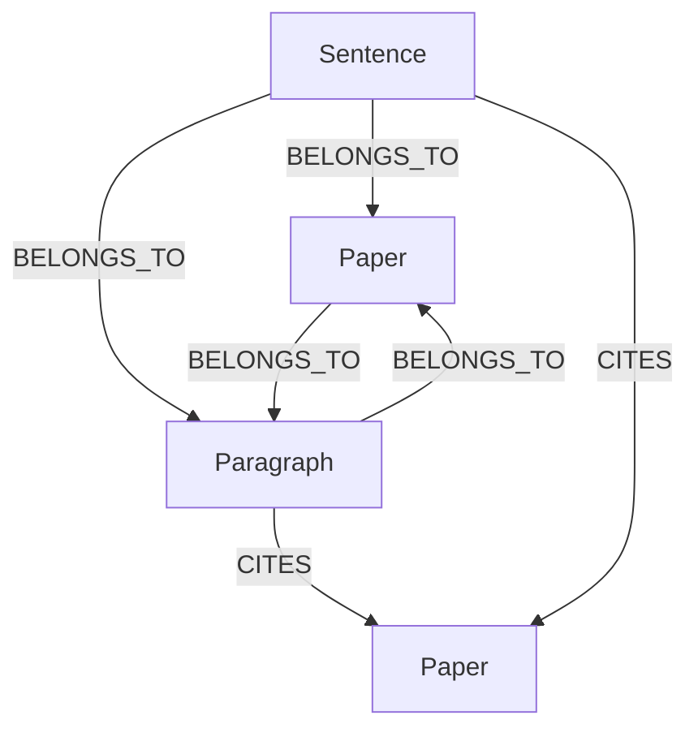

> **This project is licensed under the Apache License 2.0. See the LICENSE file for details.**

# CiteWeave Data Structure Documentation

## 🧩 Graph Database Structure (Neo4j)

### Node Types

- **Paper**
  - `id`: string (SHA256, unique, generated by PaperIDGenerator)
  - `title`: string
  - `authors`: list of string
  - `year`: int or string
  - `stub`: bool (True if only referenced, not uploaded)
  - `doi`: string (optional)
  - `journal`: string (optional)
  - `publisher`: string (optional)

- **Paragraph**
  - `id`: string (e.g., `{paper_id}_para_{index}`)
  - `text`: string
  - `paragraph_index`: int
  - `section`: string (e.g., Introduction, Methods, ...)
  - `citation_count`: int
  - `sentence_count`: int
  - `has_citations`: bool (True if this paragraph contains any citations)

- **Sentence**
  - `id`: string (e.g., `{paper_id}_sent_{index}`)
  - `text`: string
  - `sentence_index`: int
  - `has_citations`: bool
  - `word_count`: int
  - `char_count`: int

- **Argument** (可选/扩展)
  - `id`, `text`, `claim_type`, `section`, `version`, `confidence`, `custom_tags`

### Relationship Types

- `(:Sentence)-[:BELONGS_TO]->(:Paragraph)`
- `(:Sentence)-[:BELONGS_TO]->(:Paper)`
- `(:Paragraph)-[:BELONGS_TO]->(:Paper)`
- `(:Sentence)-[:CITES]->(:Paper)`
  - `citation_text`, `citation_context`, `confidence`, `created_at`
- `(:Paragraph)-[:CITES]->(:Paper)`
  - `citation_count`, `citation_density`, `created_at`
- `(:Argument)-[:BELONGS_TO]->(:Paper)`
- `(:Argument)-[:RELATES {relation_type}]->(:Argument|Paper)`

### 结构示意




## 🧬 Embedding Database Structure (Qdrant/VectorDB)

### Collections
- `claims`：句子/claim级向量
- `paragraphs`：段落级向量
- `sections`：章节级向量
- `citations`：引用文本向量

### 向量维度
- `size`: 384 (如 all-MiniLM-L6-v2)
- `distance`: Cosine

### 每个向量的元数据（payload）
- `paper_id`: string (与Graph中的Paper节点id一致)
- `sentence_index`/`paragraph_index`/`section_index`: int
- `text`: string (原始文本)
- `claim_type`: string (如有)
- `title`: string
- `authors`: list of string
- `year`: string/int
- `doi`: string
- `journal`: string
- `publisher`: string

### 存储结构
- 每个 collection 下有多个向量点（PointStruct），每个点有唯一 id、向量、payload
- 支持按 `paper_id` 聚合检索，实现整篇论文的语义聚合

### 结构示意

```text
collection: claims
  - id: uuid
    vector: [float, ...] (384维)
    payload:
      paper_id: "..."
      sentence_index: 0
      text: "..."
      claim_type: "..."
      title: "..."
      authors: ["..."]
      year: "..."
      ...
collection: paragraphs
  - id: uuid
    vector: [float, ...]
    payload: {...}
...
```

## 备注
- Paper ID 统一由 PaperIDGenerator 生成（SHA256 hash，确保全局唯一）
- 所有节点、向量的 `paper_id` 字段保持一致，实现多模态数据的跨库关联
- Graph数据库和Embedding数据库可通过 `paper_id` 实现高效联动 