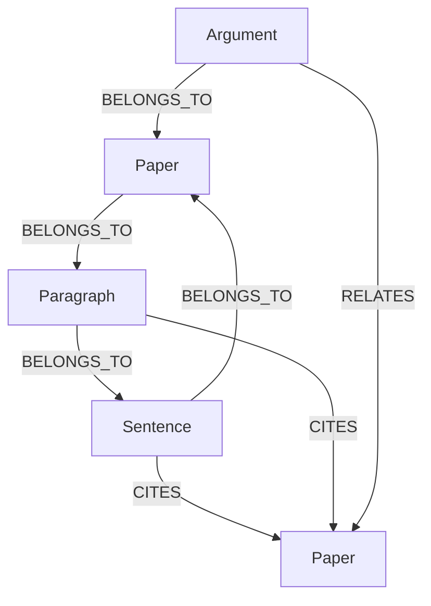

# CiteWeave Data Structure Documentation

> **This project is licensed under the Apache License 2.0. See the LICENSE file for details.**

## 🔄 **CURRENT IMPLEMENTATION UPDATE** 

### Key Features (2025)
- **Multi-Level Citation Structure**: Sentences and paragraphs support citation tracking
- **Unified Paper ID System**: SHA256-based paper identification for cross-database consistency
- **Enhanced Graph Database**: Neo4j with comprehensive node types and relationship management
- **Vector Database Integration**: Qdrant with multi-level semantic indexing
- **PDF Query System**: Direct access to complete paper content via stored processed documents

## 📄 **PDF Query System**

### Overview
CiteWeave supports direct PDF content queries, providing access to complete paper content without database limitations.

### Available Query Methods
1. **`query_pdf_content(paper_id, query)`** - Keyword search within papers
2. **`get_full_pdf_content(paper_id)`** - Complete paper content retrieval
3. **`query_pdf_by_author_and_content(author, query)`** - Author-specific content search
4. **`query_pdf_by_title_and_content(title, query)`** - Title-based content search
5. **`semantic_search_pdf_content(paper_id, query)`** - AI-powered semantic search

### Integration
- **LangGraph Tools**: All PDF functions available as AI-selectable tools
- **Hybrid Approach**: Combines database queries with direct PDF access
- **Fallback Support**: Works even when vector databases are unavailable

📖 **[Complete PDF Query Documentation](./pdf_query_system.md)**

## 🧩 Graph Database Structure (Neo4j)

### Node Types

- **Paper**
  - `id`: string (SHA256, unique, generated by PaperIDGenerator)
  - `title`: string
  - `authors`: list of string
  - `year`: int or string
  - `stub`: bool (True if only referenced, not uploaded)
  - `doi`: string (optional)
  - `journal`: string (optional)
  - `publisher`: string (optional)
  - `volume`: string (optional)
  - `issue`: string (optional) 
  - `pages`: string (optional)

- **Paragraph**
  - `id`: string (e.g., `para_{index}`)
  - `text`: string
  - `paragraph_index`: int
  - `section`: string (section name as attribute, not a separate node)
  - `citation_count`: int
  - `sentence_count`: int
  - `has_citations`: bool (True if this paragraph contains any citations)
  - `word_count`: int
  - `char_count`: int
  - `page`: int (PDF page number)

- **Sentence**
  - `id`: string (e.g., `{paper_id}_sent_{index}`)
  - `text`: string
  - `sentence_index`: int
  - `has_citations`: bool
  - `word_count`: int
  - `char_count`: int

- **Argument** (Legacy Support)
  - `id`: string
  - `text`: string
  - `claim_type`: string
  - `section`: string (optional)
  - `version`: string
  - `confidence`: float (optional)
  - `custom_tags`: list of string (optional)

### Relationship Types

- `(:Sentence)-[:BELONGS_TO]->(:Paragraph)`
- `(:Sentence)-[:BELONGS_TO]->(:Paper)`
- `(:Paragraph)-[:BELONGS_TO]->(:Paper)`
- `(:Argument)-[:BELONGS_TO]->(:Paper)` (Legacy)
- `(:Sentence)-[:CITES]->(:Paper)`
  - `citation_text`, `citation_context`, `confidence`, `created_at`
- `(:Paragraph)-[:CITES]->(:Paper)`
  - `citation_count`, `citation_density`, `created_at`
- `(:Argument)-[:RELATES]->(:Argument|:Paper)` (Legacy)
  - `relation_type`, `confidence`, `version`

### 结构示意



### Important Notes
- **Section information is stored as a string attribute** in Paragraph nodes, not as separate Section nodes
- **The actual hierarchy is**: Paper → Paragraph → Sentence
- **This design choice** provides flexibility while maintaining performance

## 🧬 Embedding Database Structure (Qdrant/VectorDB)

### Collections (Multi-Level Indexing)
- `sentences`：句子级向量
- `paragraphs`：段落级向量 
- `sections`：章节级向量（注意：这是向量索引，不是图数据库节点）
- `citations`：引用文本向量

### 向量配置
- `size`: 384 (using all-MiniLM-L6-v2)
- `distance`: Cosine
- `datatype`: float32

### Unified Payload Structure
**All collections share consistent metadata format:**

```json
{
  "paper_id": "string",
  "text": "string", 
  "title": "string",
  "authors": ["string"],
  "year": "string|int",
  "doi": "string",
  "journal": "string",
  "publisher": "string",
  "volume": "string",
  "issue": "string",
  "pages": "string"
}
```

**Collection-specific fields:**

**Sentences Collection:**
```json
{
  "sentence_index": "int",
  "sentence_type": "string",
  "has_citations": "boolean",
  "word_count": "int",
  "char_count": "int"
}
```

**Paragraphs Collection:**
```json
{
  "paragraph_index": "int", 
  "section": "string",
  "citation_count": "int",
  "sentence_count": "int",
  "has_citations": "boolean"
}
```

**Sections Collection:**
```json
{
  "section_index": "int",
  "section_title": "string", 
  "section_type": "string",
  "paragraph_count": "int"
}
```

**Citations Collection:**
```json
{
  "citation_index": "int",
  "citation_text": "string",
  "cited_paper_id": "string",
  "citation_context": "string",
  "confidence": "float"
}
```

### 结构示意

```text
collection: sentences
  - id: uuid
    vector: [float, ...] (384维)
    payload:
      paper_id: "..."
      sentence_index: 0
      sentence_type: "..."
      text: "..."
      title: "..."
      authors: ["..."]
      year: "..."
      ...
collection: paragraphs
  - id: uuid
    vector: [float, ...]
    payload: {...}
...
```

## 🔧 **Implementation Details**

### Paper ID Generation
- **Algorithm**: SHA256 hash of title + year + authors
- **Uniqueness**: Ensures global uniqueness across all databases
- **Consistency**: Same paper_id used in Neo4j, Qdrant, and file system

### Database Integration
- **GraphDB**: Handles Neo4j operations with comprehensive node and relationship management
- **VectorIndexer**: Manages Qdrant collections with unified metadata structure
- **DatabaseIntegrator**: Coordinates data flow between all storage systems

### Processing Pipeline
1. **PDF Processing**: Text extraction and structure analysis
2. **Citation Parsing**: Sentence and paragraph-level citation detection
3. **Graph Building**: Neo4j node and relationship creation
4. **Vector Indexing**: Semantic embedding generation and storage
5. **Data Synchronization**: Ensuring consistency across all databases

## 📊 **Data Flow Architecture**

```
PDF Document → DocumentProcessor → CitationParser → GraphBuilder + VectorIndexer
     ↓                    ↓              ↓              ↓
Processed JSON → DatabaseIntegrator → Neo4j + Qdrant + SQLite
```

### Section Handling in Practice
```python
# Sections are processed as follows:
for paragraph in paragraphs:
    self.graph_db.create_paragraph(
        paragraph_id=paragraph["id"],
        paper_id=paper_id,
        text=paragraph["text"],
        section=paragraph.get("section", "Unknown"),  # Section as string attribute
        # ... other attributes
    )
    
    # Section information is also indexed in vector database
    self.vector_indexer.index_sections(
        paper_id=paper_id,
        sections=section_data,  # For vector search
        metadata=metadata
    )
```

## Performance Considerations

### Advantages of Current Design
- **Simpler Graph Structure**: Fewer nodes and relationships to manage
- **Faster Queries**: Direct access to section information without graph traversal
- **Easier Maintenance**: Section changes don't require graph restructuring
- **Flexible Section Handling**: Section names can be easily updated

### Trade-offs
- **Limited Section Analysis**: Cannot perform complex graph operations on sections
- **Section Relationships**: Cannot directly model relationships between sections
- **Section Metadata**: Section-level statistics require aggregation queries

## 备注
- Paper ID 统一由 PaperIDGenerator 生成（SHA256 hash，确保全局唯一）
- 所有节点、向量的 `paper_id` 字段保持一致，实现多模态数据的跨库关联
- Graph数据库和Embedding数据库可通过 `paper_id` 实现高效联动
- 支持向后兼容，保留原有的Argument节点结构
- **Section信息作为Paragraph的属性存储**，不是独立的图节点，但在向量数据库中仍有独立的索引 