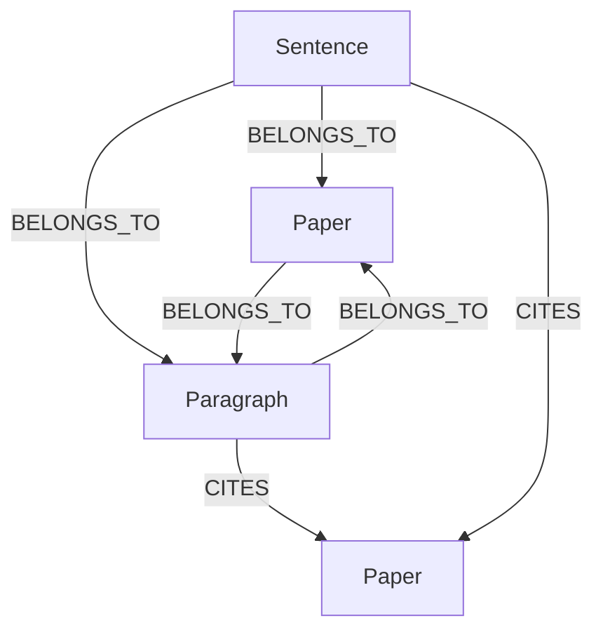

> **This project is licensed under the Apache License 2.0. See the LICENSE file for details.**

# CiteWeave Data Structure Documentation

## 🔄 **NEW PARALLEL STRUCTURE UPDATE** 

### Key Changes (2025)
- **Unified Citation Format**: All levels (sections, paragraphs, sentences) use identical citation structure
- **Parallel Arrays**: `sections[]`, `paragraphs[]`, `sentences[]` are now independent parallel arrays
- **No Nesting**: Paragraphs are no longer nested inside sections for better query performance
- **Consistent API**: Same citation format across all data access methods
- **🆕 PDF Query System**: Direct access to complete paper content via stored processed documents

## 📄 **NEW PDF Query System**

### Overview
CiteWeave now supports direct PDF content queries, providing access to complete paper content without database limitations.

### Available Query Methods
1. **`query_pdf_content(paper_id, query)`** - Keyword search within papers
2. **`get_full_pdf_content(paper_id)`** - Complete paper content retrieval
3. **`query_pdf_by_author_and_content(author, query)`** - Author-specific content search
4. **`query_pdf_by_title_and_content(title, query)`** - Title-based content search
5. **`semantic_search_pdf_content(paper_id, query)`** - AI-powered semantic search

### Integration
- **LangGraph Tools**: All PDF functions available as AI-selectable tools
- **Hybrid Approach**: Combines database queries with direct PDF access
- **Fallback Support**: Works even when vector databases are unavailable

📖 **[Complete PDF Query Documentation](./pdf_query_system.md)**

## 🧩 Graph Database Structure (Neo4j)

### Node Types

- **Paper**
  - `id`: string (SHA256, unique, generated by PaperIDGenerator)
  - `title`: string
  - `authors`: list of string
  - `year`: int or string
  - `stub`: bool (True if only referenced, not uploaded)
  - `doi`: string (optional)
  - `journal`: string (optional)
  - `publisher`: string (optional)
  - `volume`: string (optional)
  - `issue`: string (optional) 
  - `pages`: string (optional)

- **Section** (NEW)
  - `id`: string (e.g., `section_{index}`)
  - `title`: string (section heading)
  - `text`: string (full section text)
  - `section_index`: int
  - `section_type`: string (e.g., introduction, methodology, results)
  - `paragraph_count`: int
  - `word_count`: int
  - `char_count`: int

- **Paragraph**
  - `id`: string (e.g., `para_{index}`)
  - `text`: string
  - `paragraph_index`: int
  - `section`: string (name of containing section)
  - `citation_count`: int
  - `sentence_count`: int
  - `has_citations`: bool (True if this paragraph contains any citations)
  - `word_count`: int
  - `char_count`: int
  - `page`: int (PDF page number)

- **Sentence**
  - `id`: string (e.g., `{paper_id}_sent_{index}`)
  - `text`: string
  - `sentence_index`: int
  - `has_citations`: bool
  - `word_count`: int
  - `char_count`: int

### Relationship Types

- `(:Sentence)-[:BELONGS_TO]->(:Paragraph)`
- `(:Sentence)-[:BELONGS_TO]->(:Paper)`
- `(:Paragraph)-[:BELONGS_TO]->(:Paper)`
- `(:Section)-[:BELONGS_TO]->(:Paper)` (NEW)
- `(:Sentence)-[:CITES]->(:Paper)`
  - `citation_text`, `citation_context`, `confidence`, `created_at`
- `(:Paragraph)-[:CITES]->(:Paper)`
  - `citation_count`, `citation_density`, `created_at`
- `(:Section)-[:CITES]->(:Paper)` (NEW)
  - `citation_count`, `aggregated_from_paragraphs`, `created_at`

### 结构示意




## 🧬 Embedding Database Structure (Qdrant/VectorDB)

### Collections (Multi-Level Indexing)
- `sentences`：句子级向量（formerly claims collection）
- `paragraphs`：段落级向量 
- `sections`：章节级向量  
- `citations`：引用文本向量

### 向量配置
- `size`: 384 (using all-MiniLM-L6-v2)
- `distance`: Cosine
- `datatype`: float32

### Unified Payload Structure
**All collections share consistent metadata format:**

```json
{
  "paper_id": "string",
  "text": "string", 
  "title": "string",
  "authors": ["string"],
  "year": "string|int",
  "doi": "string",
  "journal": "string",
  "publisher": "string",
  "volume": "string",
  "issue": "string",
  "pages": "string"
}
```

**Collection-specific fields:**

**Sentences Collection:**
```json
{
  "sentence_index": "int",
  "has_citations": "boolean",
  "word_count": "int",
  "char_count": "int"
}
```

**Paragraphs Collection:**
```json
{
  "paragraph_index": "int", 
  "section": "string",
  "citation_count": "int",
  "sentence_count": "int",
  "has_citations": "boolean",
  "page": "int"
}
```

**Sections Collection:**
```json
{
  "section_index": "int",
  "section_title": "string", 
  "section_type": "string",
  "paragraph_count": "int"
}
```

**Citations Collection:**
```json
{
  "citation_text": "string",
  "cited_paper_id": "string",
  "context": "string",
  "confidence": "float"
}
```

### 结构示意

```text
collection: sentences
  - id: uuid
    vector: [float, ...] (384维)
    payload:
      paper_id: "..."
      sentence_index: 0
      text: "..."
      sentence_type: "..."
      title: "..."
      authors: ["..."]
      year: "..."
      ...
collection: paragraphs
  - id: uuid
    vector: [float, ...]
    payload: {...}
...
```

## 备注
- Paper ID 统一由 PaperIDGenerator 生成（SHA256 hash，确保全局唯一）
- 所有节点、向量的 `paper_id` 字段保持一致，实现多模态数据的跨库关联
- Graph数据库和Embedding数据库可通过 `paper_id` 实现高效联动 