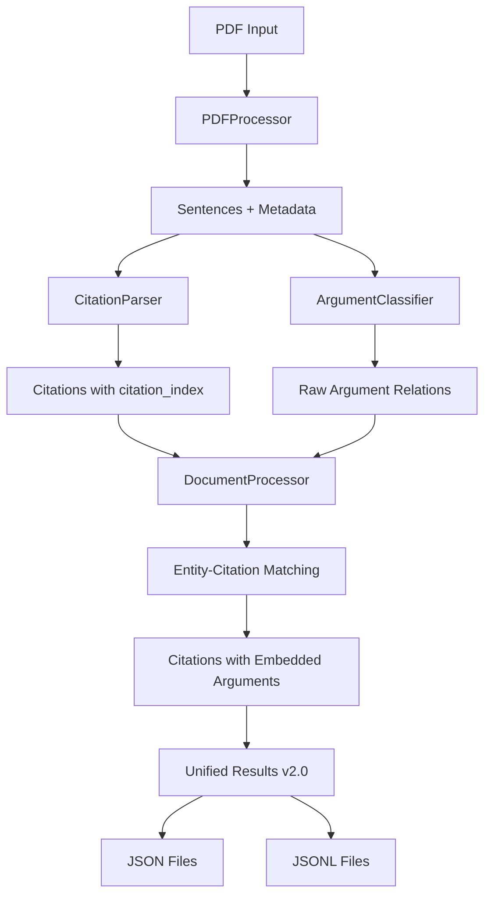

> **This project is licensed under the Apache License 2.0. See the LICENSE file for details.**

# CiteWeave Data Structure Documentation

This directory contains complete definitions and examples of all data structures used in the CiteWeave project.

## 📁 Document Structure

- [`pdf_processing.md`](./pdf_processing.md) - PDF processing related data structures
- [`citation_analysis.md`](./citation_analysis.md) - Citation analysis data structures
- [`argument_classification.md`](./argument_classification.md) - Argument relation classification data structures
- [`document_processing.md`](./document_processing.md) - Unified document processing data structures
- [`file_formats.md`](./file_formats.md) - Output file format specifications
- [`api_interfaces.md`](./api_interfaces.md) - API interface data formats
- [`QUICK_REFERENCE.md`](./QUICK_REFERENCE.md) - Quick reference and migration guide

## 🎯 Core Data Flow (v2.0)



## 📊 Data Structure Hierarchy (v2.0)

### 1. Raw Data Layer
- PDF metadata (title, authors, year, doi)
- Raw text content
- Reference list

### 2. Processing Data Layer
- Sentence segmentation results
- Citation detection results with indexing
- Argument relation classification results

### 3. Integration Data Layer (NEW v2.0)
- **Entity-Citation Matching**: Smart algorithm matches detected argument entities to specific citations
- **Citation-level Argument Embedding**: Each citation contains its own argument analysis
- **Sentence-level Summary**: High-level summary of argument relations per sentence

### 4. Output Data Layer
- Structured JSON files with citation-level argument analysis
- Line-based JSONL files with embedded argument data
- Enhanced querying capabilities

## 🚀 Version History

### v2.0 (Current) - Citation-Level Argument Analysis
**Major Breaking Changes:**
- ✅ **Citation-Level Embedding**: Argument analysis now embedded directly in each citation
- ✅ **Enhanced Matching**: Sophisticated entity-to-citation matching algorithm
- ✅ **Simplified Access**: Direct access to argument relations via `citation.argument_analysis`
- ✅ **Better Performance**: O(1) access to citation argument data
- ✅ **Cleaner Structure**: Eliminated `matched_citation_index` and `matched_paper_id` fields

**New Fields:**
- `has_citations` boolean in sentence
- `citation_index` in each citation
- `argument_analysis` object in each citation

**Removed Fields:**
- `matched_citation_index` (replaced by direct embedding)
- `matched_paper_id` (available as `citation.paper_id`)
- Sentence-level `entities` array (moved to citation level)

### v1.0 - Initial Structure
- Sentence-level argument analysis with citation matching
- Entity-citation association via index references
- Separate argument analysis structure from citations

## 🔧 Key Improvements in v2.0

### 1. Direct Citation-Argument Association
```python
# v2.0: Direct access
for citation in sentence['citations']:
    if citation['argument_analysis']['has_argument_relations']:
        for entity in citation['argument_analysis']['entities']:
            print(f"{citation['intext']} has {entity['relation_type']} relation")

# v1.0: Required index lookup
for entity in sentence['argument_analysis']['entities']:
    if entity['matched_citation_index'] is not None:
        citation = sentence['citations'][entity['matched_citation_index']]
        print(f"{citation['intext']} has {entity['relation_type']} relation")
```

### 2. Enhanced Query Capabilities
```python
# Find all ELABORATES citations
elaborates_citations = [
    cite for cite in sentence['citations']
    for entity in cite['argument_analysis']['entities']
    if entity['relation_type'] == 'ELABORATES'
]

# Count citations with argument relations
citations_with_args = sum(
    1 for cite in sentence['citations']
    if cite['argument_analysis']['has_argument_relations']
)

# Get paper IDs with specific relations
papers_that_support = [
    cite['paper_id'] for cite in sentence['citations']
    if any(e['relation_type'] == 'SUPPORTS' 
           for e in cite['argument_analysis']['entities'])
]
```

### 3. Improved Data Integrity
- **One-to-One Mapping**: Each citation directly contains its argument analysis
- **No Orphaned Entities**: Impossible to have entities without corresponding citations
- **Consistent Structure**: All citations have `argument_analysis` field (even if empty)

## 📖 Migration Guide

See [`QUICK_REFERENCE.md`](./QUICK_REFERENCE.md) for detailed migration instructions from v1.0 to v2.0.

### Breaking Changes Summary
- Update code that accesses `sentence['argument_analysis']['entities']`
- Replace `entity['matched_citation_index']` lookups with direct citation access
- Use `citation['argument_analysis']['entities']` instead of sentence-level entity matching
- Update queries to use citation-level argument analysis

### Backward Compatibility
v2.0 is **not backward compatible** with v1.0 due to structural changes. Existing v1.0 data files need to be regenerated or migrated. 