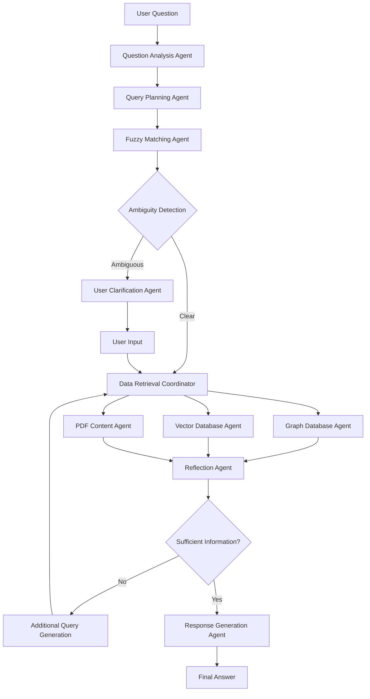

# Multi-Agent Research System Architecture

## 🧠 **CiteWeave Multi-Agent Research System (Inspired by Gemini Deep Research)**

### **System Overview**

CiteWeave的多智能体研究系统采用了类似Gemini Deep Research的反思式架构，通过多个专业化智能体协作来回答复杂的学术研究问题。系统完全基于本地数据源（Neo4j图数据库和Qdrant向量数据库），不依赖外部网络访问。

### **核心设计原则**

1. **反思式查询循环**：系统会反复评估收集到的信息是否足够回答问题
2. **用户交互机制**：当存在歧义时主动请求用户澄清
3. **专业化智能体**：每个智能体负责特定的数据源和功能
4. **渐进式信息收集**：根据问题复杂度逐步深入研究

## 🔄 **系统架构流程**



## 🤖 **智能体定义**

### **1. Question Analysis Agent (问题分析智能体)**
- **职责**：理解用户问题，识别查询意图和所需信息类型
- **输入**：用户原始问题
- **输出**：结构化的查询意图和参数
- **示例**：
  ```json
  {
    "query_type": "citation_analysis",
    "target_entity": "porter",
    "entity_type": "author",
    "required_info": ["cited_papers", "citation_contexts"],
    "complexity": "high"
  }
  ```

### **2. Fuzzy Matching Agent (模糊匹配智能体)**
- **职责**：处理模糊的实体识别（作者名、论文标题等）
- **功能**：
  - 作者名匹配（支持部分名字、不同写法）
  - 论文标题相似度匹配
  - 返回候选列表和置信度
- **交互**：当发现多个候选时触发用户澄清流程

### **3. User Clarification Agent (用户澄清智能体)**
- **职责**：管理用户交互，处理歧义消解
- **触发条件**：
  - 多个作者匹配同一个查询
  - 论文标题存在多个近似匹配
  - 查询结果置信度低于阈值
- **交互格式**：
  ```json
  {
    "clarification_type": "multiple_authors",
    "message": "Found multiple authors matching 'porter':",
    "options": [
      {"id": "author_1", "name": "Michael E. Porter", "papers_count": 15},
      {"id": "author_2", "name": "Porter, R.", "papers_count": 3}
    ],
    "user_selection": null
  }
  ```

### **4. Query Planning Agent (查询规划智能体)** 🆕
- **职责**：根据问题类型制定最优的数据库查询策略
- **核心能力**：
  - 数据库能力矩阵：了解每个数据库的优势和适用场景
  - 智能路由：根据查询类型选择最合适的数据源
  - 查询优化：避免不必要的数据库访问
- **策略矩阵**：
  ```json
  {
    "反向引用分析": ["graph_db.get_papers_citing_paper", "graph_db.get_sentences_citing_paper"],
    "引用分析": ["graph_db.get_papers_cited_by_paper"],
    "作者搜索": ["graph_db.get_papers_id_by_author", "fallback: vector_db.search_by_author"],
    "论文搜索": ["vector_db.search_all_collections"],
    "概念搜索": ["vector_db.search_all_collections"]
  }
  ```

### **5. Data Retrieval Coordinator (数据检索协调器)**
- **职责**：根据查询计划精确执行数据检索，不再盲目调用所有数据源
- **优化策略**：
  - 按计划顺序执行：只访问必要的数据库
  - 失败回退机制：当主要数据源失败时启用备选方案
  - 执行日志：记录每步查询的成功/失败状态

### **6. Graph Database Agent (图数据库智能体)**
- **职责**：执行Neo4j图数据库查询
- **核心功能**：
  ```python
  # 主要查询函数
  - get_papers_citing_paper(paper_id)
  - get_papers_cited_by_paper(paper_id) 
  - get_paragraphs_citing_paper(paper_id)
  - get_sentences_citing_paper(paper_id)
  - get_papers_by_author_fuzzy(author_name)
  - get_paper_by_title_fuzzy(title)
  ```

### **7. Vector Database Agent (向量数据库智能体)**
- **职责**：执行Qdrant向量数据库语义搜索
- **核心功能**：
  ```python
  # 主要搜索函数
  - search_relevant_sentences(query, top_n)
  - search_relevant_paragraphs(query, top_n)
  - search_relevant_sections(query, top_n)
  - search_all_content_types(query, top_n)
  ```

### **8. Reflection Agent (反思智能体)**
- **职责**：评估收集信息的完整性和充分性
- **判断标准**：
  - 信息覆盖度：是否覆盖问题的所有方面
  - 信息质量：数据的准确性和相关性
  - 逻辑完整性：是否能够形成完整的答案链条
- **输出决策**：
  ```json
  {
    "sufficient": false,
    "missing_aspects": ["citation_contexts", "paper_abstracts"],
    "next_queries": [
      "get_citation_contexts_for_papers",
      "get_paper_abstracts"
    ],
    "confidence": 0.7
  }
  ```

### **8. Response Generation Agent (回答生成智能体)**
- **职责**：整合所有收集的信息，生成结构化的最终回答
- **输出格式**：
  - 直接回答问题
  - 提供支撑证据
  - 标注信息来源
  - 突出关键发现

## 🔍 **测试用例设计**

### **目标问题**："引用波特的所有文章，他们引用的观点分别是什么"

### **预期执行流程**：

1. **问题分析阶段**：
   ```json
   {
     "query_type": "reverse_citation_analysis",
     "target_author": "porter",
     "required_info": ["citing_papers", "citation_contexts", "cited_viewpoints"]
   }
   ```

2. **模糊匹配阶段**：
   - 搜索包含"porter"的所有作者
   - 如果多个匹配，请求用户选择具体的Porter

3. **数据检索阶段**：
   ```python
   # Step 1: 获取Porter的所有论文
   porter_papers = get_papers_by_author_fuzzy("porter")
   
   # Step 2: 对每篇Porter论文，找到引用它的所有论文
   citing_papers = []
   for paper in porter_papers:
       citing_papers.extend(get_papers_citing_paper(paper.id))
   
   # Step 3: 获取引用的具体上下文和观点
   citation_contexts = []
   for citing_paper in citing_papers:
       contexts = get_sentences_citing_paper(porter_paper.id)
       citation_contexts.extend(contexts)
   ```

4. **反思阶段**：
   - 评估是否收集了足够的引用上下文
   - 判断是否需要额外的语义搜索来补充观点信息

5. **回答生成阶段**：
   ```markdown
   ## 引用Porter论文的文章及其观点分析
   
   ### Porter的核心论文：
   1. "Competitive Strategy" (1980)
   2. "What is Strategy?" (1996)
   
   ### 引用分析：
   
   #### 论文1: "Strategic Management in Digital Age" (2020)
   - **引用观点**: Porter的五力模型在数字化时代的适用性
   - **具体引用**: "Porter (1980) argues that competitive advantage stems from..."
   - **作者观点**: 认为需要扩展传统五力模型
   
   #### 论文2: "Innovation and Competitive Advantage" (2018)
   - **引用观点**: Porter关于创新与竞争优势的关系
   - **具体引用**: "Following Porter's framework..."
   - **作者观点**: 支持Porter的观点并进行了实证验证
   ```

## ⚙️ **配置和参数**

### **系统配置**
```json
{
  "ambiguity_threshold": 0.8,
  "max_reflection_cycles": 3,
  "user_timeout": 30,
  "max_results_per_query": 50,
  "confidence_threshold": 0.7
}
```

### **智能体优先级**
1. **高优先级**：Graph Database Agent（精确查询）
2. **中优先级**：Vector Database Agent（语义搜索）
3. **低优先级**：PDF Content Agent（全文搜索）

## 🎯 **成功标准**

系统成功的标志是能够：
1. **正确识别目标实体**：准确找到"Porter"对应的作者
2. **完整检索引用关系**：找到所有引用Porter论文的文章
3. **提取引用观点**：准确提取每篇引用文章的具体观点
4. **生成结构化回答**：以清晰、有逻辑的方式组织答案
5. **处理歧义情况**：当存在多个"Porter"时能够请求用户澄清

## 🚀 **实现计划**

1. **Phase 1**: 实现基础智能体框架
2. **Phase 2**: 集成现有的查询函数
3. **Phase 3**: 实现反思和用户交互机制
4. **Phase 4**: 测试和优化整个系统 