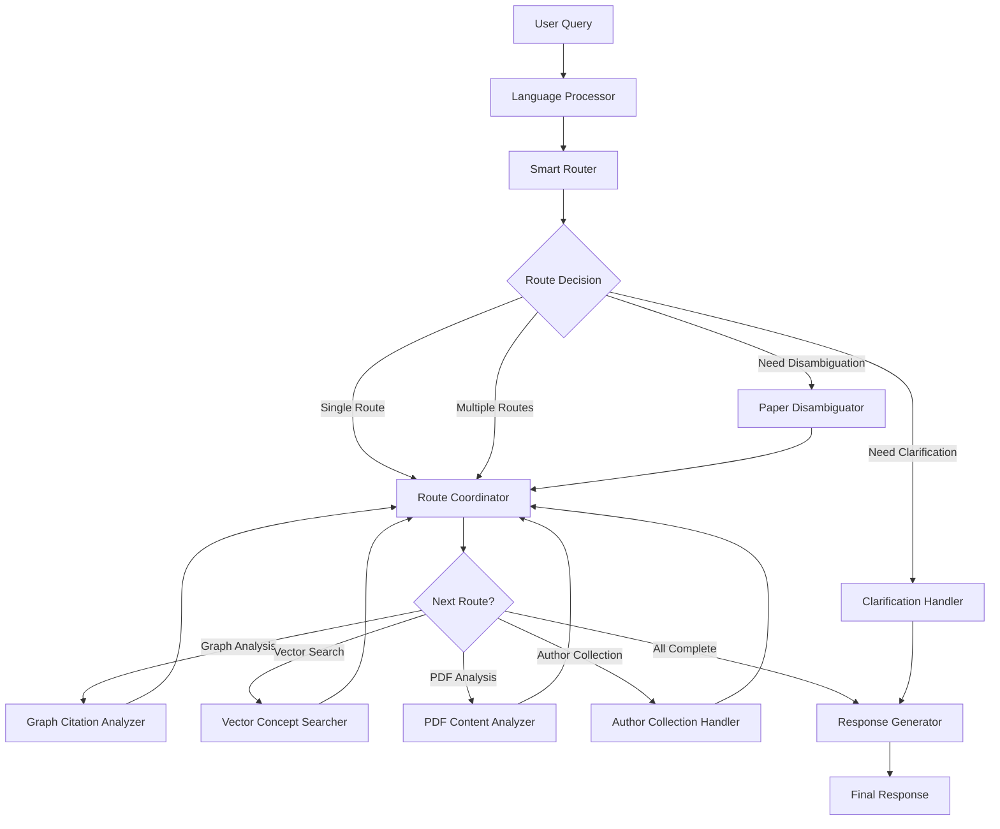

# CiteWeave 多智能体系统架构文档

## 系统概述

CiteWeave 多智能体系统是一个支持多语言、多数据源的学术论文查询系统，能够智能路由查询到不同的数据源，并综合多个Agent的结果生成全面的回答。

## 系统架构

### 核心设计原则

1. **多语言支持**: 支持中英文输入，内部处理使用英文，输出翻译回用户语言
2. **智能路由**: 单个查询可以同时路由到多个数据源
3. **并行处理**: 支持多个Agent并行执行以提高效率
4. **强大AI决策**: 使用大模型进行路由决策和内容分析
5. **模块化设计**: 每个Agent职责单一，便于维护和扩展

### 数据源分类

系统支持四类主要数据源：

1. **图数据库 (Graph Analysis)**
   - 用途: 引用关系分析、作者引用原因分析、概念在引用中的提及
   - 示例查询: "Porter 1980被引用时大家都提到什么概念", "某作者因为什么被引用"

2. **向量数据库 (Vector Search)**
   - 用途: 概念定义、语义内容搜索
   - 示例查询: "什么是竞争优势", "competitive strategy概念", "五力模型的定义"

3. **PDF分析 (PDF Analysis)**
   - 用途: 特定文档内容理解
   - 示例查询: "这篇文章讲了什么", "Porter 1980的文章内容"

4. **作者作品集 (Author Collection)**
   - 用途: 分析作者的全部作品
   - 示例查询: "Porter的所有文章", "这个作者的研究主题"

## Agent架构

### 1. Language Processor Agent (语言处理Agent)

**职责**: 多语言处理和翻译
- 检测输入语言
- 将非英文查询翻译成英文供内部处理
- 记录原始语言信息用于最终响应翻译

**输入**: 
- `original_query`: 用户原始查询
- `thread_id`, `user_id`: 会话和用户标识

**输出**:
- `processed_query`: 英文版本查询
- `user_language`: 检测到的用户语言
- `translation_used`: 是否使用了翻译

**关键方法**:
- `_detect_language()`: 语言检测
- `_translate_to_english()`: 翻译到英文

### 2. Smart Router Agent (智能路由Agent)

**职责**: 使用强大AI模型分析查询并确定需要的数据源
- 实体提取和查询分析
- 确定需要的路由列表（可多个）
- 评估路由置信度

**输入**:
- `processed_query`: 英文查询
- 数据源上下文信息

**输出**:
- `required_routes`: 需要处理的路由列表
- `extracted_entities`: 提取的实体
- `next_action`: 下一步动作

**关键特性**:
- 使用最强模型 (`prefer_powerful=True`)
- 支持多路由决策
- AI驱动的路由分析

**路由决策示例**:
```json
{
  "query": "Porter的竞争战略理论是什么以及被如何引用",
  "routes": ["vector_search", "graph_analysis"],
  "reasoning": "需要概念定义(vector_search)和引用分析(graph_analysis)"
}
```

### 3. Route Coordinator Agent (路由协调Agent)

**职责**: 管理多路由的并行执行
- 跟踪已完成和待处理的路由
- 协调Agent执行顺序
- 决定何时进入响应生成

**输入**:
- `required_routes`: 需要处理的路由
- `completed_routes`: 已完成的路由

**输出**:
- 下一个要执行的路由或响应生成指令

**执行流程**:
1. 检查剩余路由
2. 如果全部完成 → 响应生成
3. 否则 → 执行下一个路由

### 4. 专门化数据源Agent

#### Graph Citation Analyzer Agent
**职责**: 图数据库查询和引用关系分析
- 查找论文引用关系
- 分析引用方向（incoming/outgoing/both）
- 概念在引用中的提及分析

**输入**: 论文信息、查询类型
**输出**: 引用关系图谱数据

#### Vector Concept Searcher Agent  
**职责**: 向量数据库语义搜索
- 使用智能搜索自动确定粒度级别
- 概念定义查询
- 语义相似性搜索

**输入**: 英文查询
**输出**: 分级别的语义搜索结果

#### PDF Content Analyzer Agent
**职责**: PDF文档内容分析
- 查找并访问PDF文件
- 使用大上下文模型分析文档内容
- 回答文档级别问题

**特性**:
- 优先使用大上下文模型 (`prefer_large_context=True`)
- 支持多文档比较分析

#### Author Collection Handler Agent
**职责**: 作者作品集综合分析
- 查找作者所有论文
- 收集PDF文件（如果可用）
- 综合分析作者研究主题和贡献

**处理策略**:
- 优先使用PDF全文分析
- 降级到元数据分析（如PDF不可用）

### 5. Paper Disambiguator Agent

**职责**: 论文歧义消除
- 当实体不够具体时提供候选论文
- 用户选择确认
- 为后续分析提供精确的论文信息

### 6. Response Generator Agent

**职责**: 综合多数据源结果生成最终回答
- 整合来自所有已完成路由的结果
- 生成结构化、全面的回答
- 翻译回用户语言

**输入**: 
- 所有路由的结果 (`route_results`)
- 查询和上下文信息

**输出**: 
- 最终多语言回答

**关键特性**:
- 多数据源信息综合
- 结构化输出（定义→分析→关系）
- 自动语言翻译

### 7. Clarification Handler Agent

**职责**: 处理需要澄清的情况
- 生成澄清问题
- 引导用户提供更多信息

## 工作流程

### 主要执行路径



### 状态管理

系统使用 `QueryState` 数据类管理整个查询生命周期的状态：

```python
@dataclass
class QueryState:
    # 语言处理
    original_query: str
    processed_query: str  # 英文版本
    user_language: str
    translation_used: bool
    
    # 路由管理
    required_routes: List[str]
    completed_routes: List[str]
    route_results: Dict[str, Any]
    
    # 各数据源结果
    citation_relationships: Dict
    vector_results: List[Dict]
    pdf_content_analysis: str
    author_papers: List[Dict]
    
    # 错误处理
    errors: List[str]
    warnings: List[str]
    debug_messages: List[str]
```

## 智能路由机制

### AI驱动的路由决策

Smart Router Agent 使用以下策略：

1. **主要决策**: 使用大模型分析查询意图
2. **多路由支持**: 单个查询可以需要多个数据源
3. **后备机制**: 如果AI分析失败，使用模式匹配

### 路由决策示例

| 查询类型 | 需要的路由 | 原因 |
|---------|-----------|------|
| "什么是竞争优势?" | `["vector_search"]` | 概念定义查询 |
| "Porter被如何引用?" | `["graph_analysis"]` | 引用关系查询 |
| "Porter的竞争战略理论是什么以及被如何引用?" | `["vector_search", "graph_analysis"]` | 需要概念定义和引用分析 |
| "Porter所有文章的主题" | `["author_collection"]` | 作者作品集分析 |
| "分析Porter所有文章的引用影响" | `["author_collection", "graph_analysis"]` | 作品集+引用分析 |

### 模型选择策略

系统根据任务复杂度选择合适的模型：

- **路由决策**: 最强模型 (GPT-4, Claude-3-Opus等)
- **PDF分析**: 大上下文模型 (Claude-3-Haiku 200k, GPT-4-Turbo等)
- **作者作品集分析**: 大上下文模型
- **翻译**: 中等模型 (GPT-3.5-Turbo等)
- **元数据分析**: 基础模型

## 并行处理机制

### 路由并行执行

系统支持多个数据源Agent并行执行：

1. Route Coordinator 识别可并行的路由
2. 启动多个Agent同时执行
3. 等待所有路由完成
4. 综合结果生成回答

### 性能优化

- **智能缓存**: 相同查询的结果复用
- **模型复用**: 避免重复加载模型
- **连接池**: 数据库连接复用
- **批处理**: 多个相似查询合并处理

## 错误处理和容错

### 多层容错机制

1. **AI分析失败**: 降级到模式匹配
2. **数据源失败**: 跳过该路由，继续其他路由
3. **翻译失败**: 使用原语言回复
4. **PDF不可用**: 降级到元数据分析

### 调试支持

- **详细日志**: 每个Agent的执行日志
- **调试信息**: `debug_messages` 字段记录执行过程
- **错误追踪**: `errors` 和 `warnings` 字段记录问题

## 扩展性设计

### 新增数据源

添加新数据源只需：
1. 创建新的Agent类
2. 在路由器中添加路由逻辑
3. 更新工作流程配置

### 新增语言支持

添加新语言只需：
1. 更新语言检测逻辑
2. 添加翻译模型支持
3. 无需修改核心逻辑

### 新增模型支持

系统通过 `EnhancedLLMManager` 统一管理模型，添加新模型只需配置更新。

## 最佳实践

### 查询优化

1. **具体化查询**: 提供作者、年份等具体信息
2. **明确意图**: 清楚表达需要什么类型的信息
3. **多语言灵活**: 支持中英文混合查询

### 系统监控

1. **性能监控**: 关注各Agent的执行时间
2. **准确性监控**: 跟踪路由决策的准确性
3. **资源监控**: 监控模型和数据库资源使用

### 开发建议

1. **测试驱动**: 每个Agent都有对应的测试用例
2. **模块独立**: Agent之间通过状态对象通信
3. **日志完整**: 记录所有关键决策和执行过程

这个架构确保了系统的可扩展性、可维护性和高性能，同时提供了强大的多语言、多数据源查询能力。 