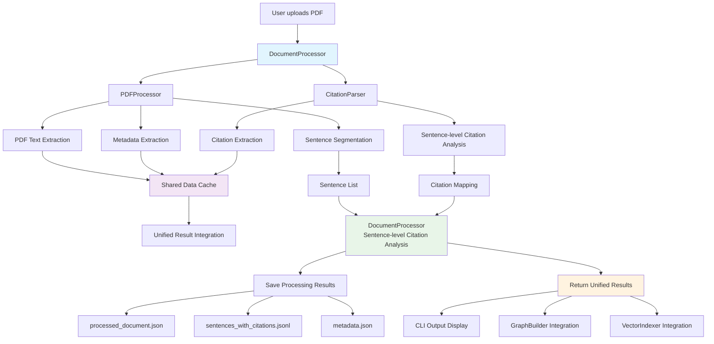
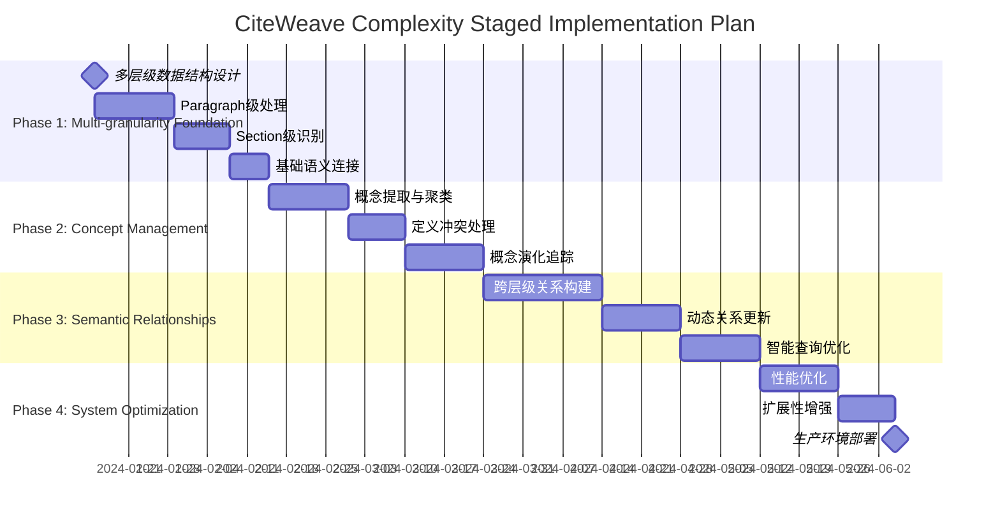
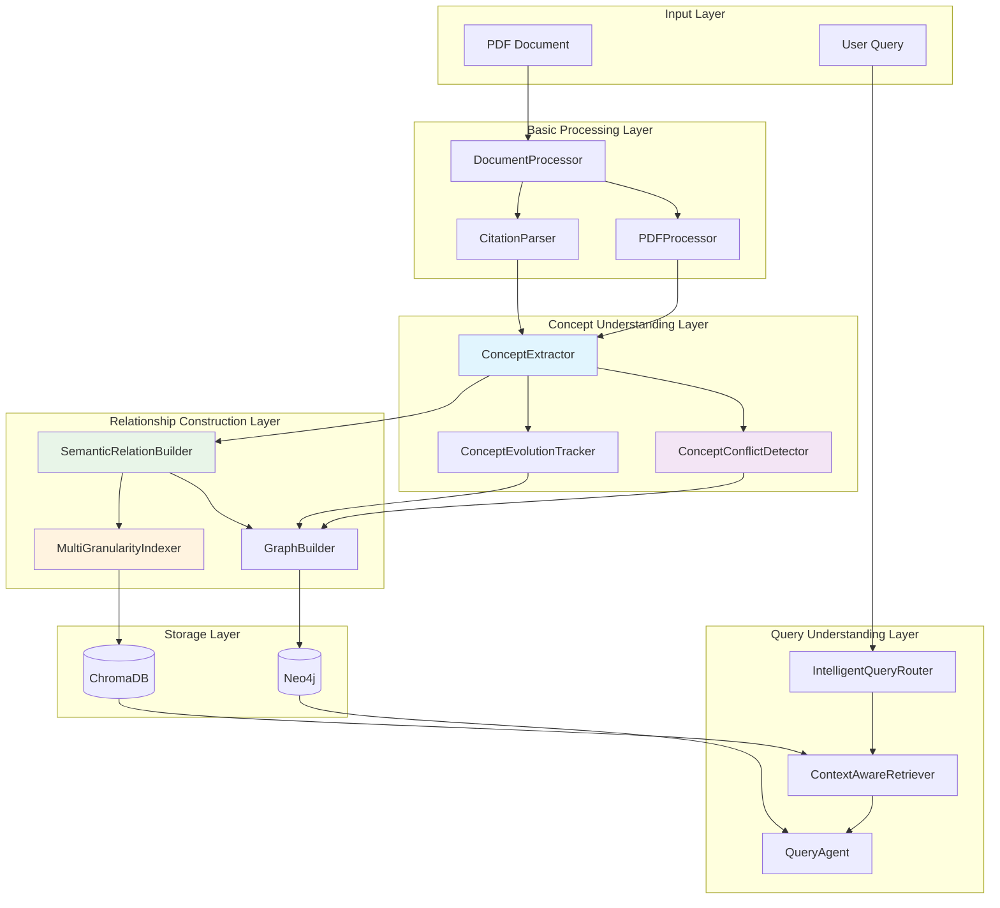

# Product Requirements Document (PRD)

**Project Name:** Argument-Level Citation Graph + RAG Intelligent Interaction System  
**Version:** v0.7  
**Owner:** Yinji Zhou  
**Created:** 2025-07-14 (Updated for v0.7 - Complexity Management & Concept Conflict Handling Framework)

---

## 1. Project Goals

Build a system that supports fine-grained citation analysis: organize and represent reasoning chains in papers at the "argument-level" (such as claim, evidence, mechanism, causal statement), and combine knowledge graphs and semantic retrieval to enable academic Q&A, citation path analysis, and long-term memory support.

The system integrates Neo4j as a structured graph database, LlamaIndex as the embedded semantic index layer, LangChain as the LLM interaction middleware, and optionally MemGPT as a memory agent. The system supports automatic information extraction after PDF upload, building argument structures and citation edges; supports delayed citation completion mechanism.

---

## 2. Core Feature Requirements

### 1. User Interaction Logic & Data Flow

#### 1.1 Interaction Methods

- Users upload a single paper PDF via CLI: e.g. `upload_paper ./path/to/PaperA.pdf`
- The system reads and parses the PDF, extracts text paragraphs, structure, metadata (title, authors, year)
- The system extracts:
  - All argument/claim/evidence units in the paper
  - Sentences with citations + their targets (e.g. "see Smith 2022" in text)
- Output: Build `:Paper` nodes, multiple `:Argument` nodes, and create `:CITES` edges (create `stub` targets if needed)

#### 1.2 Delayed Citation Completion Logic

- If the cited paper is not yet uploaded, create a `:Paper {stub: true}` placeholder node
- Citation edge marked as `status: "pending"`
- When the cited source is later uploaded, automatically parse and complete the edge, updating to `status: "resolved"`

#### 1.3 Data Flow Logic (Detailed)

1. User uploads PDF
2. Use LLM (GPT-4/Claude) for section and sentence-level processing
3. For each sentence, determine type:
   - Is it an argument (claim-like unit)?
   - If yes → label `claim_type`
   - If no → mark as `NON_ARGUMENT`
4. Build structured `:Argument` nodes
5. Detect citation statements (LLM+regex)
6. Determine if the cited object exists, establish `CITES` edge or stub
7. Write to graph database and embedding index library

---

## 3. Argument Types & Relation Types

### 3.1 Argument `claim_type` Classification (Extensible)

| `claim_type`             | Description                             |
|--------------------------|----------------------------------|
| `CLAIM_MAIN`             | Main claim point                    |
| `CLAIM_SUPPORTING`       | Secondary supporting claim                  |
| `EVIDENCE_EMPIRICAL`     | Empirical data or conclusion support              |
| `EVIDENCE_THEORETICAL`   | Theoretical logic or model support              |
| `EVIDENCE_LITERATURE`    | Reference literature support                |
| `COUNTERARGUMENT`        | Counter-argument, assumption                  |
| `CONTEXT_LIMITATION`     | Scope, boundary conditions limit              |
| `METHODOLOGY`            | Method description                        |
| `ASSUMPTION`             | Model setting or basic assumption              |
| `REBUTTAL`               | Explicit rebuttal of other research points            |
| `QUESTION_MOTIVATION`    | Research question or motivation              |
| `FUTURE_WORK`            | Future research suggestions                |
| `NEUTRAL`                | Neutral sentence                         |
| `NON_ARGUMENT`           | Ordinary sentence (explanation, transition)  |

> Extension mechanism:
> - All claim_type saved in `claim_types.yaml` or Neo4j `:ClaimTypeSchema`
> - Argument nodes should include fields: `claim_type_version`, `custom_tags`, `confidence`
> - Model template reads supported claim_type from this table

---

### 3.2 Relation Types (Extensible)

| `relation_type`     | Description                                 |
|---------------------|--------------------------------------|
| `CITES`             | Explicit citation                            |
| `SUPPORTS`          | Logical support                        |
| `REFUTES`           | Explicit rebuttal                            |
| `ELABORATES`        | Elaboration                            |
| `QUALIFIES`         | Add premise/condition                       |
| `EXTENDS`           | Extend others' theory                        |
| `CONTRASTS`         | Parallel contrast (not equal to rebuttal)             |
| `REPEATS`           | Repeat previous conclusions                        |
| `USES_METHOD_OF`    | Method directly borrowed                        |
| `INSPIRED_BY`       | Research inspiration source                        |

> Extension mechanism:
> - All relations unified as `RELATES` type, using attribute `relation_type`
> - Attribute fields should include: `confidence`, `evidence_type`, `version`
> - Model template reads supported relation_type from this table

---

## 4. Database Structure Design

### 4.1 Neo4j Graph Structure

- `:Paper {id, title, authors, year, doi, stub}`
- `:Argument {id, text, claim_type, section, text_hash, version, confidence, custom_tags}`
- `(:Argument)-[:BELONGS_TO]->(:Paper)`
- `(:Argument)-[:RELATES {relation_type, version}]->(:Argument|Paper)`

### 4.2 Vector Library Structure (Chroma / FAISS)

- Each Argument → one vector
- Metadata fields: `claim_type`, `section`, `paper_id`, `authors`, `title`

### 4.3 Metadata Schema Nodes

- `:ClaimTypeSchema {id, description, version, is_deprecated}`
- `:RelationTypeSchema {id, description, version, is_custom}`

---

## 5. System Architecture & Data Flow

### 5.1 DocumentProcessor Unified Architecture Diagram



### 5.2 Architectural Design Principles

**Core Goal:** Implement unified sentence-level citation analysis, providing a complete citation mapping for each sentence.

**Design Advantages:**
- **Unified Interface:** `DocumentProcessor` as a single entry point, coordinating `PDFProcessor` and `CitationParser`
- **Efficiency Optimization:** Avoid duplicate PDF parsing, share metadata and citation data
- **Data Consistency:** Ensure PDF processing and citation analysis use the same data source
- **Error Recovery:** Sentence-level error handling, single sentence failure does not affect overall processing
- **Scalability:** Reserve interfaces for subsequent integration of `ArgumentClassifier`, `GraphBuilder`

**Data Flow:**
1. **PDF Processing Stage:** Extract text, split sentences, extract metadata
2. **Citation Analysis Stage:** Perform sentence-by-sentence citation detection and matching based on sentence list
3. **Result Integration Stage:** Unify sentence and citation analysis results
4. **Persistence Stage:** Save results in various formats
5. **Downstream Integration:** Provide standardized data interfaces for graph construction and vector indexing

---

## 6. Module Design (Modular Architecture)

| Module                  | Function                                  | Method Interface                             |
|-----------------------|---------------------------------------|--------------------------------------|
| `DocumentProcessor`   | **Unified Coordinator:** Sentence-level Citation Analysis       | `process_document()`, `get_sentences_with_citations()`, `diagnose_document_processing()` |
| `PDFProcessor`        | PDF Text Extraction, Sentence Segmentation, Metadata Extraction    | `parse_sentences()`, `extract_pdf_metadata()`, `extract_text_with_best_engine()` |
| `CitationParser`      | Citation Detection, Parsing, Matching to References       | `parse_sentence()`, `parse_document()`, `match_intext_to_reference()` |
| `LLMArgumentClassifier` | Use LLM to label claim_type            | `classify_claim_type()`              |
| `GraphBuilder`        | Build Graph Nodes and Relations                   | `create_argument_nodes()`, `link_edges()` |
| `VectorIndexer`       | Embedding Generation and Indexing                | `embed_arguments()`, `add_to_index()` |
| `StubResolver`        | Complete stub citations                      | `resolve_stub()`                     |
| `QueryAgent`          | Support Natural Language Q&A and Semantic Retrieval          | `query_argument()`, `semantic_search()` |
| `CLIInterface`        | Command Line Interaction Entry                       | `upload_paper()`, `query_argument()`  |

---

## 7. Command Line Interface Design (CLI)

### 7.1 Main Commands

| Command                          | Function Description                         | New Architecture Features                        |
|-------------------------------|----------------------------------|-----------------------------------|
| `upload <path>`               | Unified Document Processing (Sentence-level Citation Analysis)   | Use `DocumentProcessor` to coordinate processing |
| `upload <path> --diagnose`    | Document Processing with Quality Diagnosis             | PDF + Citation Double Quality Assessment              |
| `diagnose <path>`             | Independent Processing Quality Diagnosis               | Comprehensive Diagnosis Report                      |
| `query <query>`               | Academic Q&A (Based on Sentence-level Index)       | Precise Citation Context at Sentence Level          |
| `list_pending_citations`      | View Unresolved Citations List               | Based on Sentence-level Citation Analysis Results            |
| `resolve_stub <paper_id> <pdf>` | Complete Citation Target                     | Automatically Update Sentence-level Citation Mapping            |

### 7.2 Output Format

**Processing Result File Structure:**
```
data/papers/{paper_id}/
├── processed_document.json      # Full Processing Results
├── sentences_with_citations.jsonl  # Sentence-level Citation Data
├── metadata.json               # Document Metadata
└── quality_report.json         # Quality Diagnosis Report
```

**Sentence-level Citation Analysis Output Example:**
```json
{
  "sentence_index": 42,
  "sentence_text": "Porter (1980) argues that competitive advantage stems from...",
  "citations": [
    {
      "intext": "(Porter, 1980)",
      "reference": {
        "title": "Competitive Strategy",
        "authors": ["Michael E. Porter"],
        "year": "1980"
      },
      "paper_id": "sha256_hash_value"
    }
  ],
  "word_count": 15,
  "char_count": 89
}
```

---

## 8. Academic RAG System Evolution Plan

### 8.1 Design Goals

Build an RAG system that supports high-freedom academic queries, capable of answering complex questions of the following types:
- "Who cited Porter (1980) and supported his competitive advantage theory?"
- "Which articles refuted Nelson and Winter (1982) evolutionary theory?"
- "In the field of strategic management, which studies extended Resource-Based View?"
- "Which literature used Milgrom and Roberts methodology?"

### 8.2 Three-Phase Evolution Roadmap

#### Phase 1: Context Granularity Enhancement (v0.7) - **Priority Implementation**

**Goal:** Enhance multi-granularity context information in the existing v2.0 architecture, improving the semantic depth of citation analysis.

**Core Functions:**
- **Paragraph-level Context:** Identify the topic and argumentative logic of the paragraph where the citation is located
- **Section Identification:** Automatically identify Introduction, Methods, Results, etc. sections
- **Discourse Role Classification:** Based on the existing claim_type, identify the argumentative function of sentences
- **Semantic Position Annotation:** Premise, argument, conclusion, etc. logical positions

**Data Structure Extension:**
```json
{
  "sentence_index": 42,
  "sentence_text": "Porter (1980) argues...",
  "context_metadata": {
    "section": "Literature Review",
    "subsection": "Competitive Strategy",
    "paragraph_index": 15,
    "paragraph_theme": "theoretical_foundation",
    "discourse_role": "CLAIM_MAIN",
    "semantic_position": "premise"
  },
  "citations": [...],
  "argument_analysis": {...}
}
```

**Implementation Focus:**
- [ ] Extend PDFProcessor to add paragraph-level parsing
- [ ] Add section identification function
- [ ] Implement discourse role classifier (based on existing ArgumentClassifier extension)
- [ ] Update DocumentProcessor to integrate new context information

#### Phase 2: Semantic Relationship Deepening (v0.8) - **Medium-term Plan**

**Goal:** Deepen the semantic expression of citation relationships, build an author-concept network, and support more accurate academic queries.

**Core Functions:**
- **Semantic Rich Relation Metadata:** Argument purpose, citation stance, evidence type
- **Author-Concept Network:** Track scholars' theoretical contributions and citation patterns
- **Concept Extractor:** Automatically identify key theoretical concepts in literature
- **Citation Purpose Classification:** theoretical_foundation, empirical_validation, etc.

**Data Structure Extension:**
```json
{
  "relation_type": "SUPPORTS",
  "confidence": 0.856,
  "entity_text": "Porter (1980)",
  "semantic_metadata": {
    "argumentative_purpose": "theoretical_foundation",
    "cited_aspect": "competitive_advantage_theory",
    "citing_stance": "acceptance",
    "elaboration_type": "conceptual_extension",
    "evidence_type": "theoretical"
  }
}
```

**Technical Components:**
- ConceptExtractor: LLM-based concept extraction
- AuthorNetworkBuilder: Build author-concept mapping
- StanceClassifier: Identify citation stance (supports/criticizes/neutral)

#### Phase 3: Knowledge Graph & Intelligent Query (v0.9) - **Long-term Vision**

**Goal:** Build a complete academic knowledge graph, enabling complex academic queries in natural language.

**Core Functions:**
- **Neo4j Graph Upgrade:** Paper-Claim-Author-Concept-Theory multi-layer network
- **Temporal Evolution Tracking:** Theoretical development trajectory analysis
- **Intelligent Query Engine:** Natural language → Query Intent → Multi-dimensional Retrieval → Intelligent Sorting
- **Multi-level Vector Retrieval:** Sentence-level, claim-level, semantic search

**Neo4j Schema Design:**
```cypher
// Enhanced Node Types
(:Paper {id, title, authors, year, domain, key_concepts})
(:Claim {id, text, type, domain, evidence_type})
(:Author {name, affiliation, research_domains})
(:Concept {name, domain, definition})
(:Theory {name, domain, foundational_papers})

// Enhanced Relation Types
(:Paper)-[:CITES {relation_type, strength, aspect, purpose, stance}]->(:Paper)
(:Claim)-[:SUPPORTS|REFUTES|EXTENDS {strength, evidence_type}]->(:Claim)
```

**Query Interface Example:**
```python
class EnhancedRAGQuery:
    def query_citations_by_stance(self, author, work, stance="supports"):
        """Query citations by specific stance"""
        
    def query_theory_evolution(self, theory_name, time_range):
        """Query theory evolution"""
        
    def query_methodology_usage(self, method, domain):
        """Query methodology usage"""
```

### 8.3 Technical Architecture Evolution

#### v0.7 Architecture Focus (Phase 1)
```
DocumentProcessor (Enhanced)
├── PDFProcessor + SectionClassifier
├── CitationParser (unchanged)
├── ArgumentClassifier + DiscourseAnalyzer
└── ContextMetadataExtractor (new)
```

#### v0.8 Architecture Expansion (Phase 2)
```
+ ConceptExtractor
+ SemanticRelationEnhancer
+ AuthorNetworkBuilder
+ StanceClassifier
```

#### v0.9 Full Architecture (Phase 3)
```
+ Neo4jKnowledgeGraph
+ AcademicQueryEngine
+ TemporalEvolutionTracker
+ MultiLevelVectorIndexer
```

### 8.4 Expected Query Capability Evolution

| Version | Query Capability | Example |
|------|----------|------|
| v0.6 (Current) | Basic Citation Retrieval | "Find sentences citing Porter (1980)" |
| v0.7 (Phase 1) | Context-aware Retrieval | "Sentences citing Porter in the theoretical construction section" |
| v0.8 (Phase 2) | Semantic Stance Query | "Management papers supporting Porter's competitive positioning theory" |
| v0.9 (Phase 3) | Complex Academic Query | "Trace the evolution path and main criticisms of RBV theory from 1990 to present" |

---

## 9. Complexity Management & Staged Implementation Strategy

### 9.1 Core Complexity Identification

**First Layer Complexity: Technical Architecture**
- Multi-granularity data processing (Sentence → Paragraph → Section → Paper)
- Multi-modal knowledge representation (Vector + Graph + Structured Data)
- Dynamic semantic relationship construction (Concept clustering + Relationship evolution)

**Second Layer Complexity: Semantic Understanding**
- Concept ambiguity and definition conflict
- Cross-literature citation stance identification
- Academic concept temporal evolution tracking

**Third Layer Complexity: System Integration**
- Multi-Agent collaboration and decision-making
- Real-time query vs. offline processing balance
- System scalability and performance optimization

### 9.2 Risk Mitigation Strategies

**Technical Risk Mitigation:**
- **Hierarchical Validation:** Independently test and validate each granularity level
- **Incremental Integration:** Test single modules first, then integrate between modules
- **Degradation Mechanism:** Fallback to basic functionality when complex features fail

**Complexity Control Principles:**
- **Minimum Viable Product (MVP):** Prioritize core query functions
- **Modular Design:** High cohesion, low coupling module division
- **Standardized Interfaces:** Unified data interfaces and error handling

### 9.3 Staged Implementation Timeline



---

## 10. Concept Definition Conflict Handling Framework

### 10.1 Concept Definition Conflict Types

**Conflict Types:**

| Conflict Type | Description | Example | Resolution Strategy |
|----------|------|------|----------|
| **Evolutionary Conflict** | Definition change of the same concept over time | "Strategic Management" concept from 1960s to present | Time dimension tracking |
| **School Conflict** | Different academic schools' different understanding of the same concept | RBV's "Resource" definition: Barney vs. Peteraf | School label classification |
| **Granularity Conflict** | Different abstraction levels of concept definitions | "Innovation": Technological innovation vs. Business model innovation | Hierarchical concept tree |
| **Domain Conflict** | Definition differences of cross-disciplinary concepts in different fields | "Network": Sociology vs. Computer Science | Domain context tagging |
| **Methodological Conflict** | Concept definitions based on different methodologies | "Performance": Financial metrics vs. Balanced Scorecard | Methodology tagging |

### 10.2 Concept Definition Management Data Structure

#### Neo4j Concept Management Schema
```cypher
// Concept Main Nodes
(:Concept {
    id: "strategic_management",
    name: "Strategic Management", 
    canonical_definition: "...",
    first_appeared: 1962,
    domain: "management",
    status: "active"
})

// Concept Definition Variation Nodes
(:ConceptDefinition {
    id: "strategic_mgmt_porter_1980",
    definition_text: "...",
    confidence: 0.95,
    evidence_count: 15,
    paper_id: "porter_1980_competitive_strategy",
    section: "introduction",
    definition_type: "foundational|refinement|critique",
    temporal_scope: "1980-1990"
})

// Relation Design
(:Concept)-[:HAS_DEFINITION {
    temporal_validity: "1980-present",
    academic_acceptance: 0.85,
    citation_frequency: 245
}]->(:ConceptDefinition)

(:ConceptDefinition)-[:CONFLICTS_WITH {
    conflict_type: "evolutionary|paradigmatic|methodological",
    resolution_strategy: "temporal_tracking|context_labeling"
}]->(:ConceptDefinition)

(:ConceptDefinition)-[:DERIVES_FROM]->(:ConceptDefinition)
(:ConceptDefinition)-[:REFINES]->(:ConceptDefinition)
```

### 10.3 Concept Conflict Resolution Mechanism

#### Automatic Conflict Detection Algorithm
```python
class ConceptConflictDetector:
    def detect_definition_conflicts(self, new_definition, existing_definitions):
        """
        Multi-dimensional Conflict Detection:
        1. Semantic similarity < 0.6 and concept name same → Potential conflict
        2. Keyword overlap analysis
        3. Definition scope inclusion check
        4. Temporal dimension consistency verification
        """
        conflicts = []
        
        for existing_def in existing_definitions:
            semantic_sim = self.compute_semantic_similarity(new_definition, existing_def)
            temporal_overlap = self.check_temporal_overlap(new_definition, existing_def)
            domain_overlap = self.check_domain_overlap(new_definition, existing_def)
            
            if semantic_sim < 0.6 and temporal_overlap and domain_overlap:
                conflict_type = self.classify_conflict_type(new_definition, existing_def)
                conflicts.append({
                    'type': conflict_type,
                    'existing_definition': existing_def,
                    'similarity_score': semantic_sim,
                    'resolution_strategy': self.suggest_resolution(conflict_type)
                })
        
        return conflicts
    
    def suggest_resolution(self, conflict_type):
        strategies = {
            'evolutionary': 'temporal_versioning',
            'paradigmatic': 'school_labeling', 
            'methodological': 'method_tagging',
            'domain_specific': 'context_scoping'
        }
        return strategies.get(conflict_type, 'manual_review')
```

#### Conflict Resolution Strategy Implementation
```python
class ConceptConflictResolver:
    def resolve_evolutionary_conflict(self, definitions):
        """Time Evolutionary Conflict: Establish concept evolution chain"""
        sorted_defs = sorted(definitions, key=lambda x: x.year)
        for i, current_def in enumerate(sorted_defs[1:], 1):
            previous_def = sorted_defs[i-1]
            self.create_evolution_link(previous_def, current_def)
    
    def resolve_paradigmatic_conflict(self, definitions):
        """School Conflict: Identify school based on citation network"""
        schools = self.cluster_by_citation_network(definitions)
        for school, school_defs in schools.items():
            for definition in school_defs:
                definition.add_label(f"school:{school}")
    
    def resolve_domain_conflict(self, definitions):
        """Domain Conflict: Context tagging"""
        for definition in definitions:
            domain = self.extract_domain_context(definition)
            definition.add_context_tag(f"domain:{domain}")
```

### 10.4 Concept Evolution Tracking System

#### Concept Lifecycle Management
```python
class ConceptEvolutionTracker:
    def track_concept_lifecycle(self, concept_id):
        """
        Track the complete lifecycle of a concept:
        - Concept Emergence: First clear definition
        - Concept Development: Definition refinement and expansion  
        - Concept Differentiation: Derive sub-concepts
        - Concept Integration: Merge with other concepts
        - Concept Decline: Usage frequency decreases
        - Concept Revival: Re-gains attention
        """
        evolution_phases = {
            'emergence': self.detect_concept_emergence(concept_id),
            'development': self.track_definition_refinement(concept_id),
            'differentiation': self.identify_concept_branching(concept_id),
            'integration': self.detect_concept_merging(concept_id),
            'decline': self.measure_usage_decline(concept_id),
            'revival': self.detect_renewed_interest(concept_id)
        }
        return evolution_phases
    
    def generate_concept_timeline(self, concept_id):
        """Generate concept evolution timeline visualization"""
        events = self.extract_significant_events(concept_id)
        return self.create_timeline_visualization(events)
```

---

## 11. New Module Design

### 11.1 Core New Module List

| Module Name | Main Function | Input | Output | Dependencies |
|----------|----------|------|------|----------|
| **ConceptExtractor** | Concept Identification and Extraction | Sentence/Paragraph Text | Concept Entities + Definitions | LLMInterface |
| **ConceptConflictDetector** | Concept Conflict Detection | New Concept Definition | Conflict Report | ConceptExtractor |
| **ConceptEvolutionTracker** | Concept Evolution Tracking | Concept Historical Data | Evolution Timeline | GraphBuilder |
| **SemanticRelationBuilder** | Cross-layer Relationship Construction | Multi-layer Nodes | Semantic Relationship Edges | VectorIndexer |
| **MultiGranularityIndexer** | Multi-granularity Vector Indexing | Text at Each Level | Hierarchical Vector Index | VectorIndexer |
| **IntelligentQueryRouter** | Intelligent Query Routing | User Query | Query Strategy | QueryAgent |
| **ContextAwareRetriever** | Context-aware Retrieval | Query + Context | Relevant Document Fragments | MultiGranularityIndexer |

### 11.2 Module Detailed Design

#### ConceptExtractor (Concept Extractor)
```python
class ConceptExtractor:
    """
    Multi-level Concept Extraction:
    - Sentence Level: Specific concept instances
    - Paragraph Level: Concept explanation and application
    - Section Level: Concept systematic elaboration
    - Paper Level: Concept overall contribution
    """
    
    def __init__(self):
        self.concept_patterns = self.load_concept_patterns()
        self.definition_classifiers = self.load_definition_classifiers()
    
    def extract_concepts_multi_level(self, document_hierarchy):
        """Multi-level Concept Extraction"""
        results = {
            'sentence_concepts': [],
            'paragraph_themes': [],
            'section_concepts': [], 
            'paper_contributions': []
        }
        
        # Sentence-level Concept Extraction
        for sentence in document_hierarchy['sentences']:
            concepts = self.extract_sentence_concepts(sentence)
            results['sentence_concepts'].extend(concepts)
        
        # Paragraph-level Theme Identification
        for paragraph in document_hierarchy['paragraphs']:
            themes = self.extract_paragraph_themes(paragraph)
            results['paragraph_themes'].extend(themes)
            
        # Section-level Concept System
        for section in document_hierarchy['sections']:
            concepts = self.extract_section_concepts(section)
            results['section_concepts'].extend(concepts)
            
        # Paper-level Contribution Identification
        paper_concepts = self.extract_paper_contributions(document_hierarchy)
        results['paper_contributions'] = paper_concepts
        
        return results
    
    def extract_concept_definitions(self, text, concept_name):
        """Extract definition for a specific concept"""
        definition_patterns = [
            f"{concept_name} is defined as",
            f"{concept_name} refers to", 
            f"We define {concept_name} as",
            f"{concept_name}，即",
            f"{concept_name}是指"
        ]
        
        definitions = []
        for pattern in definition_patterns:
            matches = self.find_definition_sentences(text, pattern)
            definitions.extend(matches)
            
        return self.classify_definition_quality(definitions)
```

#### ConceptConflictDetector (Concept Conflict Detector)
```python
class ConceptConflictDetector:
    """
    Concept Definition Conflict Detection and Classification:
    - Detect potential concept definition inconsistencies
    - Classify conflict types
    - Suggest resolution strategies
    """
    
    def __init__(self):
        self.similarity_threshold = 0.6
        self.conflict_classifiers = self.load_conflict_classifiers()
    
    def detect_all_conflicts(self, concept_database):
        """Detect potential conflicts for all concepts"""
        conflicts = []
        
        for concept_id, definitions in concept_database.items():
            if len(definitions) > 1:
                concept_conflicts = self.analyze_concept_conflicts(
                    concept_id, definitions
                )
                conflicts.extend(concept_conflicts)
                
        return self.prioritize_conflicts(conflicts)
    
    def analyze_concept_conflicts(self, concept_id, definitions):
        """Analyze definition conflicts for a single concept"""
        conflicts = []
        
        for i, def1 in enumerate(definitions):
            for j, def2 in enumerate(definitions[i+1:], i+1):
                conflict = self.compare_definitions(def1, def2)
                if conflict['has_conflict']:
                    conflicts.append({
                        'concept_id': concept_id,
                        'definition_1': def1,
                        'definition_2': def2,
                        'conflict_type': conflict['type'],
                        'severity': conflict['severity'],
                        'resolution_strategy': conflict['strategy']
                    })
                    
        return conflicts
    
    def suggest_resolution_strategy(self, conflict):
        """Suggest resolution strategies for conflicts"""
        strategy_map = {
            'temporal': self.create_temporal_versions,
            'paradigmatic': self.create_school_labels,
            'domain': self.create_context_scopes,
            'methodological': self.create_method_tags
        }
        
        return strategy_map.get(
            conflict['type'], 
            self.flag_for_manual_review
        )(conflict)
```

#### MultiGranularityIndexer (Multi-granularity Indexer)
```python
class MultiGranularityIndexer:
    """
    Multi-level Vector Index Management:
    - Establish independent vector indexes for each granularity level
    - Support cross-granularity semantic search
    - Intelligent granularity selection
    """
    
    def __init__(self):
        self.indexes = {
            'sentence': ChromaIndexer('sentence_index'),
            'paragraph': ChromaIndexer('paragraph_index'),
            'section': ChromaIndexer('section_index'),
            'paper': ChromaIndexer('paper_index')
        }
    
    def build_multi_level_index(self, document_hierarchy):
        """Build multi-level index"""
        indexing_results = {}
        
        for level, content_list in document_hierarchy.items():
            level_index = self.indexes[level]
            
            for content in content_list:
                embedding = self.generate_embedding(content['text'])
                metadata = self.prepare_metadata(content, level)
                
                level_index.add(
                    embedding=embedding,
                    metadata=metadata,
                    id=content['id']
                )
                
            indexing_results[level] = len(content_list)
            
        return indexing_results
    
    def smart_granularity_search(self, query, query_type):
        """Intelligent Granularity Selection Search"""
        # Select optimal granularity combination based on query type
        granularity_strategy = self.determine_optimal_granularity(
            query, query_type
        )
        
        results = {}
        for level, weight in granularity_strategy.items():
            level_results = self.indexes[level].search(
                query, 
                top_k=int(10 * weight)
            )
            results[level] = level_results
            
        return self.merge_multi_level_results(results, granularity_strategy)
```

### 11.3 Module Collaboration Relationship Diagram



---

## 12. Technical Complexity Decomposition & Implementation Roadmap

### 12.1 Complexity Decomposition Matrix

| Function Module | Technical Difficulty | Implementation Time | Dependencies | Risk Level | Priority |
|----------|----------|----------|----------|----------|--------|
| **Multi-granularity Index** | Medium | 2 weeks | VectorIndexer | Low | High |
| **Concept Extraction** | High | 3 weeks | LLMInterface | Medium | High |
| **Conflict Detection** | High | 4 weeks | ConceptExtractor | High | Medium |
| **Semantic Relationship Construction** | High | 3 weeks | ConceptExtractor | Medium | High |
| **Concept Evolution Tracking** | Medium | 2 weeks | GraphBuilder | Low | Medium |
| **Intelligent Query Routing** | Medium | 2 weeks | QueryAgent | Low | High |
| **Context-aware Retrieval** | High | 3 weeks | MultiGranularityIndexer | Medium | High |

### 12.2 Staged Implementation Strategy

#### Phase 1: Basic Multi-granularity Support (4 weeks)
**Goal:** Establish multi-level data processing and indexing capabilities

**Week 1-2: Multi-granularity Data Structure**
- [ ] Extend DocumentProcessor to support paragraph and section identification
- [ ] Implement basic MultiGranularityIndexer version
- [ ] Establish hierarchical data storage format

**Week 3-4: Basic Concept Extraction**
- [ ] Implement ConceptExtractor's sentence-level concept extraction
- [ ] Establish basic LLM pipeline for concept entity recognition
- [ ] Integrate into existing DocumentProcessor

**Key Milestones:** 
- Can process multi-level document structure
- Basic concept extraction functionality running
- Multi-granularity vector index available

#### Phase 2: Semantic Understanding Enhancement (5 weeks)
**Goal:** Enhance concept understanding and relationship recognition

**Week 5-7: Concept Conflict Handling**
- [ ] Implement ConceptConflictDetector
- [ ] Establish concept definition quality assessment system
- [ ] Implement basic conflict resolution strategies

**Week 8-9: Semantic Relationship Construction**
- [ ] Implement SemanticRelationBuilder
- [ ] Establish cross-layer semantic connection mechanism
- [ ] Integrate into GraphBuilder

**Key Milestones:**
- Concept conflict auto-detection running
- Cross-layer semantic relationships established
- Enhanced knowledge graph structure

#### Phase 3: Intelligent Query Optimization (4 weeks)
**Goal:** Implement intelligent query understanding and context-aware retrieval

**Week 10-11: Query Understanding**
- [ ] Implement IntelligentQueryRouter
- [ ] Establish query type classification system
- [ ] Implement granularity selection strategy

**Week 12-13: Context Retrieval**
- [ ] Implement ContextAwareRetriever
- [ ] Establish multi-level result fusion mechanism
- [ ] Optimize retrieval performance

**Key Milestones:**
- Intelligent query routing functionality
- Context-aware retrieval capability
- End-to-end query flow optimization

#### Phase 4: System Optimization & Extension (3 weeks)
**Goal:** Performance optimization, concept evolution tracking, production environment preparation

**Week 14-15: Concept Evolution**
- [ ] Implement ConceptEvolutionTracker
- [ ] Establish time-based concept tracking
- [ ] Implement concept lifecycle management

**Week 16: System Integration & Optimization**
- [ ] Overall system performance optimization
- [ ] Error handling and degradation mechanisms
- [ ] Production environment deployment preparation

### 12.3 Technical Risk Management

#### High-risk Technical Points & Mitigation Strategies

**1. Concept Conflict Detection Accuracy**
- **Risk:** LLM's ability to identify concept definition differences may be inaccurate
- **Mitigation:** Establish an annotated training dataset, combine rules and ML methods
- **Degradation:** If conflict detection fails, mark for manual review

**2. Multi-granularity Semantic Relationship Construction**  
- **Risk:** Cross-layer relationships may be too complex, affecting query performance
- **Mitigation:** Implement relationship weight and importance scoring, prioritize building high-value relationships
- **Degradation:** If complex relationship construction fails, maintain basic citation relationships

**3. Large-scale Document Processing Performance**
- **Risk:** Multi-level processing may lead to exponential growth in processing time
- **Mitigation:** Implement parallel processing and incremental update mechanisms
- **Degradation:** If performance is insufficient, limit document granularity

#### Technical Debt Management
- **Code Quality:** Code refactoring after each Phase
- **Documentation Maintenance:** Real-time update of technical documentation and API documentation
- **Test Coverage:** Ensure each new module has complete unit tests

### 12.4 Success Evaluation Metrics

#### Technical Metrics
- **Processing Capability:** Single document processing time < 5 minutes
- **Retrieval Precision:** Average precision@10 for multi-granularity retrieval > 0.8
- **Concept Coverage:** Concept extraction recall rate > 0.85
- **Conflict Detection:** Concept conflict detection accuracy > 0.75

#### Business Metrics  
- **Query Success Rate:** User query success rate > 0.9
- **Response Time:** Average query response time < 3 seconds
- **User Satisfaction:** User rating based on query result quality > 4.0/5.0

---

## 13. Version Update Records

### v0.7.0 (Current Version) - Complexity Management & Concept Conflict Handling Framework

**New Features:**
- **Complexity Decomposition Strategy:** Establish a three-layer complexity identification system (Technical Architecture, Semantic Understanding, System Integration)
- **Concept Conflict Handling Framework:** Design 5 conflict type classifications and automatic resolution mechanisms
- **Multi-granularity Architecture Enhancement:** 7 new modules (ConceptExtractor, ConceptConflictDetector, MultiGranularityIndexer, etc.)
- **Staged Implementation Plan:** 16-week detailed implementation roadmap, including 4 development phases
- **Technical Risk Management:** High-risk point identification, mitigation strategies, and degradation mechanisms

**Architecture Improvements:**
- **Concept Management Data Structure:** Neo4j concept management schema, supporting concept definition versioning and conflict tracking
- **Module Collaboration:** Clearly define input/output and dependencies for the 7 new modules
- **Complexity Control Principles:** MVP priority, modular design, standardized interfaces
- **Evaluation Metric System:** Quantitative evaluation standards for technical and business metrics

**Innovative Features:**
- **Concept Evolution Tracking:** Concept lifecycle management (Birth → Development → Differentiation → Integration → Decline → Revival)
- **Multi-dimensional Conflict Detection:** Combined conflict identification (Semantic Similarity + Time Dimension + Domain Context)
- **Intelligent Granularity Selection:** Automatic selection of optimal retrieval granularity combination based on query type
- **Context-aware Retrieval:** Intelligent retrieval optimization for multi-level result fusion

### v0.6.1 - DocumentProcessor Unified Architecture

**New Features:**
- Introduced `DocumentProcessor` as a unified coordinator for sentence-level citation analysis
- Optimized `PDFProcessor` and `CitationParser` integration to avoid duplicate processing
- Added comprehensive quality diagnosis functionality covering PDF processing and citation analysis
- Extended CLI interface to support processing with diagnosis

**Architecture Improvements:**
- Unified Data Flow: PDF Processing → Sentence Extraction → Citation Analysis → Result Integration
- Intelligent Caching: Metadata and citation data shared between modules, avoiding duplicate GROBID calls
- Error Recovery: Sentence-level error handling, single sentence failure does not affect overall processing
- Scalability: Reserve standardized interfaces for ArgumentClassifier, GraphBuilder

**Standardized Output Format:**
- `processed_document.json`: Full processing results
- `sentences_with_citations.jsonl`: Sentence-level citation mapping
- `quality_report.json`: Comprehensive quality assessment

### v0.7 (Planned) - Context Granularity Enhancement

**Planned Features:**
- Paragraph-level context analysis
- Automatic section identification
- Discourse role classification
- Semantic position annotation

---

> **Development Priority:** Currently focused on v0.7 (Phase 1) implementation to establish a solid context-aware foundation for the academic RAG system. Phase 2 and Phase 3 are medium-term technical roadmaps, which will be adjusted based on the implementation effect of v0.7 and user feedback.