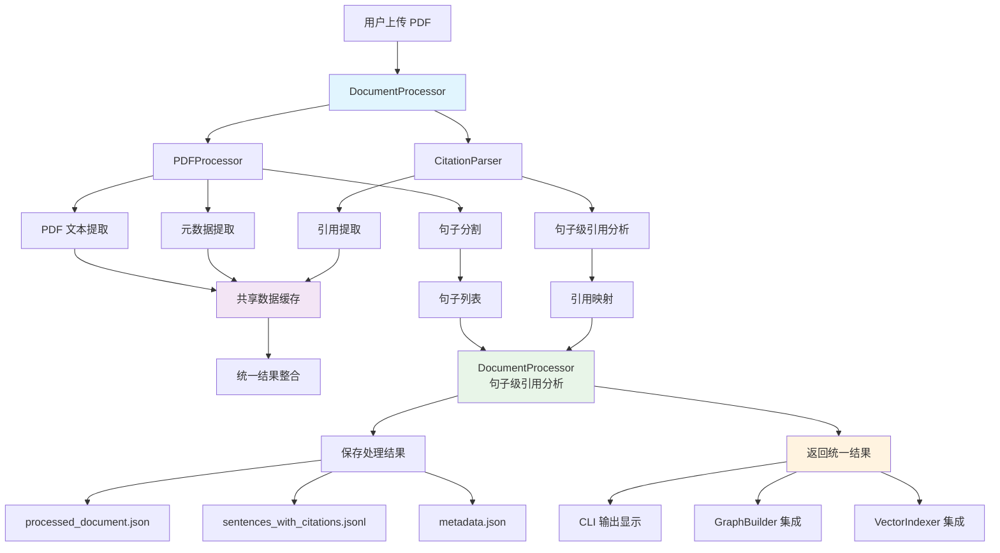
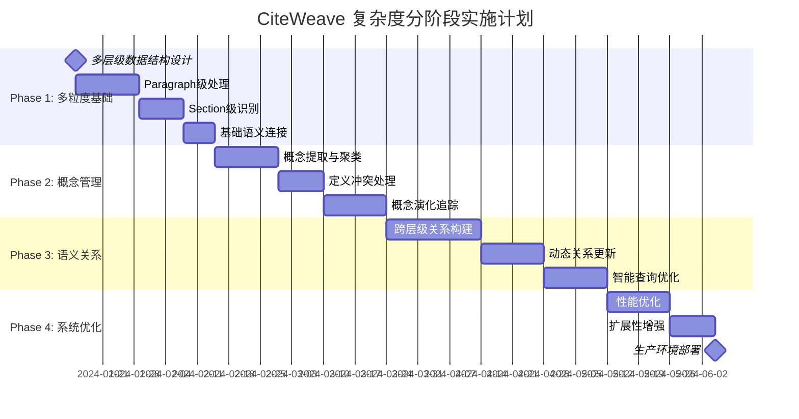
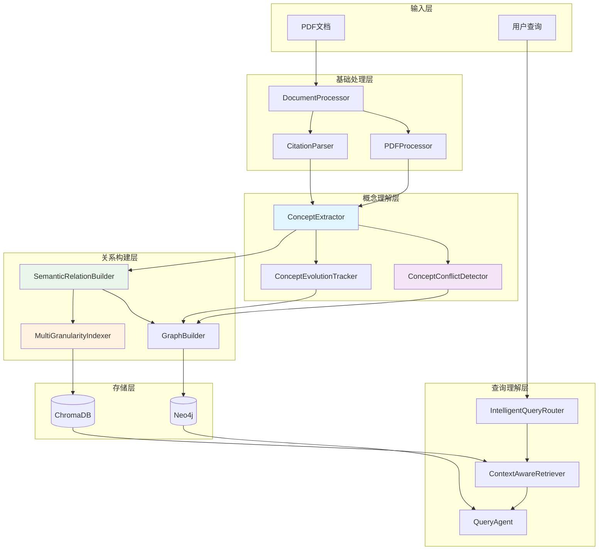

# 产品需求文档（PRD）

**项目名称：** Argument-Level Citation Graph + RAG 智能交互系统  
**版本：** v0.7  
**负责人：** Yinji Zhou  
**创建时间：** 2025-07-14（更新于 v0.7 - 复杂度管理与概念冲突处理框架）

---

## 一、项目目标

构建一个能够支持细粒度论文引用分析的系统：以 "argument-level" 为单位组织和表示论文中的推理链条（如 claim、evidence、mechanism、causal statement），并结合知识图谱和语义检索，实现学术问答、引用路径分析和长期记忆支持。

该系统将集成 Neo4j 作为结构化图数据库，LlamaIndex 作为嵌入式语义索引层，LangChain 作为语言模型交互中间件，并可选接入 MemGPT 作为 memory agent。系统支持 PDF 上传后自动抽取信息，构建 argument 结构与引用边；支持引用延迟补全机制。

---

## 二、核心功能需求

### 1. 用户交互逻辑与数据流

#### 1.1 交互方式

- 用户通过命令行上传单篇论文 PDF 文件：如 `upload_paper ./path/to/PaperA.pdf`
- 系统读取并解析 PDF，提取文本段落、结构、metadata（title, authors, year）
- 系统抽取：
  - 本文内所有 argument/claim/证据单元
  - 本文引用的句子 + 被引用的目标（如文中出现 “see Smith 2022”）
- 输出：构建 `:Paper` 节点、若干 `:Argument` 节点、并建立 `:CITES` 边（如需，创建 `stub` 目标）

#### 1.2 延迟引用补全逻辑

- 若引用目标论文尚未上传，创建 `:Paper {stub: true}` 占位节点
- 引用边标记为 `status: "pending"`
- 后续上传引用源文件后，自动解析并补全边，更新为 `status: "resolved"`

#### 1.3 数据流处理逻辑（详细）

1. 用户上传 PDF
2. 使用 LLM (GPT-4/Claude) 对 PDF 分段与句子级处理
3. 判断每句类型：
   - 是否为 argument（claim-like 单位）
   - 若是 → 标注 `claim_type`
   - 若否 → 标记为 `NON_ARGUMENT`
4. 构建结构化 `:Argument` 节点
5. 检测引用语句（LLM+正则）
6. 判断引用对象是否已存在，建立 `CITES` 边或 stub
7. 写入图数据库和嵌入索引库

---

## 三、Argument 类型与关系类型

### 3.1 Argument `claim_type` 分类（可扩展）

| `claim_type`             | 描述                             |
|--------------------------|----------------------------------|
| `CLAIM_MAIN`             | 主张性主论点                    |
| `CLAIM_SUPPORTING`       | 次级支持性主张                  |
| `EVIDENCE_EMPIRICAL`     | 实证数据或结论支持              |
| `EVIDENCE_THEORETICAL`   | 理论逻辑或模型支持              |
| `EVIDENCE_LITERATURE`    | 引用他人文献支持                |
| `COUNTERARGUMENT`        | 反方观点、假设                  |
| `CONTEXT_LIMITATION`     | 范围、边界条件限制              |
| `METHODOLOGY`            | 方法说明                        |
| `ASSUMPTION`             | 模型设定或基础假设              |
| `REBUTTAL`               | 明确反驳其他研究观点            |
| `QUESTION_MOTIVATION`    | 提出研究问题或动机              |
| `FUTURE_WORK`            | 提出未来研究建议                |
| `NEUTRAL`                | 无立场句                         |
| `NON_ARGUMENT`           | 无需建图的普通句（说明、过渡）  |

> 扩展机制：
> - 所有 claim_type 保存在 `claim_types.yaml` 或 Neo4j `:ClaimTypeSchema`
> - Argument 节点应包含字段：`claim_type_version`, `custom_tags`, `confidence`
> - 模型template中，说支持的claim_type从这张表里读取

---

### 3.2 关系类型（可扩展）

| `relation_type`     | 描述                                 |
|---------------------|--------------------------------------|
| `CITES`             | 明确引用                            |
| `SUPPORTS`          | 表示逻辑支持                        |
| `REFUTES`           | 明确驳斥                            |
| `ELABORATES`        | 扩展说明                            |
| `QUALIFIES`         | 添加前提/条件                       |
| `EXTENDS`           | 拓展他人理论                        |
| `CONTRASTS`         | 并列对比（不等于反驳）             |
| `REPEATS`           | 重复前人结论                        |
| `USES_METHOD_OF`    | 方法直接借用                        |
| `INSPIRED_BY`       | 研究灵感来源                        |

> 扩展机制：
> - 所有关系统一为 `RELATES` 类型，使用属性 `relation_type`
> - 属性字段应包括：`confidence`, `evidence_type`, `version`
> - 模型的template中，说支持的relation_type从这张表里读取

---

## 四、数据库结构设计

### 4.1 Neo4j 图谱结构

- `:Paper {id, title, authors, year, doi, stub}`
- `:Argument {id, text, claim_type, section, text_hash, version, confidence, custom_tags}`
- `(:Argument)-[:BELONGS_TO]->(:Paper)`
- `(:Argument)-[:RELATES {relation_type, version}]->(:Argument|Paper)`

### 4.2 向量库结构（Chroma / FAISS）

- 每个 Argument → 一个向量
- 元数据字段：`claim_type`, `section`, `paper_id`, `authors`, `title`

### 4.3 元数据 schema 节点

- `:ClaimTypeSchema {id, description, version, is_deprecated}`
- `:RelationTypeSchema {id, description, version, is_custom}`

---

## 五、系统架构与数据流

### 5.1 DocumentProcessor 统一架构图



### 5.2 架构设计原则

**核心目标**：实现统一的句子级引用分析，为每个句子提供完整的引用映射关系。

**设计优势**：
- **统一接口**：`DocumentProcessor` 作为单一入口点，协调 `PDFProcessor` 和 `CitationParser`
- **效率优化**：避免重复PDF解析，共享元数据和引用数据
- **数据一致性**：确保PDF处理和引用分析使用相同的数据源
- **错误恢复**：句子级别的错误处理，单个句子失败不影响整体处理
- **可扩展性**：为后续集成 `ArgumentClassifier`、`GraphBuilder` 预留接口

**数据流说明**：
1. **PDF处理阶段**：提取文本、分割句子、提取元数据
2. **引用分析阶段**：基于句子列表进行逐句引用检测和匹配
3. **结果整合阶段**：将句子和引用分析结果统一打包
4. **持久化阶段**：保存多种格式的结果文件
5. **下游集成**：为图构建和向量索引提供标准化数据接口

---

## 六、模块设计（模块化架构）

| 模块                  | 功能                                  | 方法接口                             |
|-----------------------|---------------------------------------|--------------------------------------|
| `DocumentProcessor`   | **统一协调器**：句子级引用分析       | `process_document()`, `get_sentences_with_citations()`, `diagnose_document_processing()` |
| `PDFProcessor`        | PDF文本提取、句子分割、元数据提取    | `parse_sentences()`, `extract_pdf_metadata()`, `extract_text_with_best_engine()` |
| `CitationParser`      | 引用检测、解析、匹配到参考文献       | `parse_sentence()`, `parse_document()`, `match_intext_to_reference()` |
| `LLMArgumentClassifier` | 使用 LLM 标注 claim_type            | `classify_claim_type()`              |
| `GraphBuilder`        | 构建图谱节点和关系                   | `create_argument_nodes()`, `link_edges()` |
| `VectorIndexer`       | 嵌入生成与索引库写入                | `embed_arguments()`, `add_to_index()` |
| `StubResolver`        | 补全 stub 引用                      | `resolve_stub()`                     |
| `QueryAgent`          | 支持自然语言问答与语义检索          | `query_argument()`, `semantic_search()` |
| `CLIInterface`        | 命令行交互入口                       | `upload_paper()`, `query_argument()`  |

---

## 七、命令行接口设计（CLI）

### 7.1 主要命令

| 命令                          | 功能说明                         | 新架构特性                        |
|-------------------------------|----------------------------------|-----------------------------------|
| `upload <path>`               | 统一文档处理（句子级引用分析）   | 使用 `DocumentProcessor` 协调处理 |
| `upload <path> --diagnose`    | 带质量诊断的文档处理             | PDF+引用双重质量评估              |
| `diagnose <path>`             | 独立的处理质量诊断               | 综合诊断报告                      |
| `query <query>`               | 学术问答（基于句子级索引）       | 精确到句子级的引用上下文          |
| `list_pending_citations`      | 查看未补全引用列表               | 基于句子级引用分析结果            |
| `resolve_stub <paper_id> <pdf>` | 补全引用目标                     | 自动更新句子级引用映射            |

### 7.2 输出格式

**处理结果文件结构**：
```
data/papers/{paper_id}/
├── processed_document.json      # 完整处理结果
├── sentences_with_citations.jsonl  # 句子级引用数据
├── metadata.json               # 文档元数据
└── quality_report.json         # 质量诊断报告
```

**句子级引用分析输出示例**：
```json
{
  "sentence_index": 42,
  "sentence_text": "Porter (1980) argues that competitive advantage stems from...",
  "citations": [
    {
      "intext": "(Porter, 1980)",
      "reference": {
        "title": "Competitive Strategy",
        "authors": ["Michael E. Porter"],
        "year": "1980"
      },
      "paper_id": "sha256_hash_value"
    }
  ],
  "word_count": 15,
  "char_count": 89
}
```

---

## 八、学术级RAG系统演进规划

### 8.1 设计目标

构建支持高自由度学术查询的RAG系统，能够回答如下类型的复杂问题：
- "谁引用了Porter (1980)并且支持他的竞争优势理论？"
- "有哪些文章反驳了Nelson and Winter (1982)的演化理论？"
- "在战略管理领域，哪些研究扩展了Resource-Based View？"
- "有哪些文献使用了Milgrom and Roberts的方法论？"

### 8.2 三阶段演进路线图

#### Phase 1: 上下文粒度增强 (v0.7) - **优先实施**

**目标**：在现有v2.0架构基础上，增加多粒度上下文信息，提升引用分析的语义深度。

**核心功能**：
- **段落级上下文**：识别引用所在段落的主题和论证逻辑
- **章节识别**：自动识别Introduction、Methods、Results等章节
- **话语角色分类**：基于现有claim_type扩展，识别句子的论证功能
- **语义位置标注**：premise、argument、conclusion等逻辑位置

**数据结构扩展**：
```json
{
  "sentence_index": 42,
  "sentence_text": "Porter (1980) argues...",
  "context_metadata": {
    "section": "Literature Review",
    "subsection": "Competitive Strategy",
    "paragraph_index": 15,
    "paragraph_theme": "theoretical_foundation",
    "discourse_role": "CLAIM_MAIN",
    "semantic_position": "premise"
  },
  "citations": [...],
  "argument_analysis": {...}
}
```

**实施重点**：
- [ ] 扩展PDFProcessor增加段落级解析
- [ ] 添加章节识别功能
- [ ] 实现话语角色分类器（基于现有ArgumentClassifier扩展）
- [ ] 更新DocumentProcessor集成新的上下文信息

#### Phase 2: 语义关系深化 (v0.8) - **中期规划**

**目标**：深化引用关系的语义表达，构建作者-概念网络，支持更精准的学术查询。

**核心功能**：
- **语义丰富的关系元数据**：论证目的、引用立场、证据类型
- **作者-概念网络**：追踪学者的理论贡献和引用模式
- **概念提取器**：自动识别文献中的关键理论概念
- **引用目的分类**：theoretical_foundation、empirical_validation等

**数据结构扩展**：
```json
{
  "relation_type": "SUPPORTS",
  "confidence": 0.856,
  "entity_text": "Porter (1980)",
  "semantic_metadata": {
    "argumentative_purpose": "theoretical_foundation",
    "cited_aspect": "competitive_advantage_theory",
    "citing_stance": "acceptance",
    "elaboration_type": "conceptual_extension",
    "evidence_type": "theoretical"
  }
}
```

**技术组件**：
- ConceptExtractor：基于LLM的概念提取
- AuthorNetworkBuilder：构建作者-概念映射
- StanceClassifier：识别引用立场（支持/批评/中性）

#### Phase 3: 知识图谱与智能查询 (v0.9) - **长期愿景**

**目标**：构建完整的学术知识图谱，实现自然语言的复杂学术查询。

**核心功能**：
- **Neo4j图谱升级**：Paper-Claim-Author-Concept-Theory多层网络
- **时间演化追踪**：理论发展轨迹分析
- **智能查询引擎**：自然语言→查询意图→多维检索→智能排序
- **多层次向量检索**：句子级、声称级、概念级语义搜索

**Neo4j Schema设计**：
```cypher
// 增强的节点类型
(:Paper {id, title, authors, year, domain, key_concepts})
(:Claim {id, text, type, domain, evidence_type})
(:Author {name, affiliation, research_domains})
(:Concept {name, domain, definition})
(:Theory {name, domain, foundational_papers})

// 增强的关系类型
(:Paper)-[:CITES {relation_type, strength, aspect, purpose, stance}]->(:Paper)
(:Claim)-[:SUPPORTS|REFUTES|EXTENDS {strength, evidence_type}]->(:Claim)
```

**查询接口示例**：
```python
class EnhancedRAGQuery:
    def query_citations_by_stance(self, author, work, stance="supports"):
        """查询特定立场的引用"""
        
    def query_theory_evolution(self, theory_name, time_range):
        """理论演化查询"""
        
    def query_methodology_usage(self, method, domain):
        """方法论应用查询"""
```

### 8.3 技术架构演进

#### v0.7 架构重点（Phase 1）
```
DocumentProcessor (Enhanced)
├── PDFProcessor + SectionClassifier
├── CitationParser (unchanged)
├── ArgumentClassifier + DiscourseAnalyzer
└── ContextMetadataExtractor (new)
```

#### v0.8 架构扩展（Phase 2）
```
+ ConceptExtractor
+ SemanticRelationEnhancer
+ AuthorNetworkBuilder
+ StanceClassifier
```

#### v0.9 完整架构（Phase 3）
```
+ Neo4jKnowledgeGraph
+ AcademicQueryEngine
+ TemporalEvolutionTracker
+ MultiLevelVectorIndexer
```

### 8.4 预期查询能力演进

| 版本 | 查询能力 | 示例 |
|------|----------|------|
| v0.6 (当前) | 基础引用检索 | "找到引用Porter (1980)的句子" |
| v0.7 (Phase 1) | 上下文感知检索 | "在理论构建部分引用Porter的句子" |
| v0.8 (Phase 2) | 语义立场查询 | "支持Porter竞争定位理论的管理学论文" |
| v0.9 (Phase 3) | 复杂学术查询 | "追踪RBV理论从1990年至今的演化路径和主要批评观点" |

---

## 九、复杂度管理与分阶段实施策略

### 9.1 核心复杂度识别

**第一层复杂度：技术架构**
- 多粒度数据处理（Sentence → Paragraph → Section → Paper）
- 多模态知识表示（向量 + 图谱 + 结构化数据）
- 动态语义关系构建（概念聚类 + 关系演化）

**第二层复杂度：语义理解**
- 概念歧义与定义冲突
- 跨文献的引用立场识别
- 学术概念的时间演化追踪

**第三层复杂度：系统集成**
- 多Agent协作与决策
- 实时查询与离线处理平衡
- 系统可扩展性与性能优化

### 9.2 风险缓解策略

**技术风险缓解**：
- **分层验证**：每个粒度层级独立测试和验证
- **增量集成**：先单模块测试，再模块间集成
- **降级机制**：复杂功能失败时回退到基础功能

**复杂度控制原则**：
- **最小可用产品(MVP)**：优先实现核心查询功能
- **模块化设计**：高内聚、低耦合的模块划分
- **接口标准化**：统一的数据接口和错误处理

### 9.3 分阶段实施时间线



---

## 十、概念定义冲突处理框架

### 10.1 概念定义冲突的类型分析

**定义冲突分类**：

| 冲突类型 | 描述 | 示例 | 处理策略 |
|----------|------|------|----------|
| **演化型冲突** | 同一概念在不同时期的定义变化 | "Strategic Management"概念从1960年代到现在 | 时间维度追踪 |
| **学派型冲突** | 不同学术流派对同一概念的不同理解 | RBV的"资源"定义：Barney vs. Peteraf | 学派标签分类 |
| **粒度型冲突** | 概念定义的抽象层次不同 | "Innovation"：技术创新 vs. 商业模式创新 | 层次化概念树 |
| **领域型冲突** | 跨学科概念在不同领域的定义差异 | "Network"：社会学 vs. 计算机科学 | 领域上下文标注 |
| **方法型冲突** | 基于不同方法论的概念定义 | "Performance"：财务指标 vs. 平衡计分卡 | 方法论标签 |

### 10.2 概念定义管理数据结构

#### Neo4j概念管理Schema
```cypher
// 概念主节点
(:Concept {
    id: "strategic_management",
    name: "Strategic Management", 
    canonical_definition: "...",
    first_appeared: 1962,
    domain: "management",
    status: "active"
})

// 概念定义变体节点
(:ConceptDefinition {
    id: "strategic_mgmt_porter_1980",
    definition_text: "...",
    confidence: 0.95,
    evidence_count: 15,
    paper_id: "porter_1980_competitive_strategy",
    section: "introduction",
    definition_type: "foundational|refinement|critique",
    temporal_scope: "1980-1990"
})

// 关系设计
(:Concept)-[:HAS_DEFINITION {
    temporal_validity: "1980-present",
    academic_acceptance: 0.85,
    citation_frequency: 245
}]->(:ConceptDefinition)

(:ConceptDefinition)-[:CONFLICTS_WITH {
    conflict_type: "evolutionary|paradigmatic|methodological",
    resolution_strategy: "temporal_tracking|context_labeling"
}]->(:ConceptDefinition)

(:ConceptDefinition)-[:DERIVES_FROM]->(:ConceptDefinition)
(:ConceptDefinition)-[:REFINES]->(:ConceptDefinition)
```

### 10.3 概念冲突解决机制

#### 自动冲突检测算法
```python
class ConceptConflictDetector:
    def detect_definition_conflicts(self, new_definition, existing_definitions):
        """
        多维度冲突检测：
        1. 语义相似度 < 0.6 且概念名称相同 → 潜在冲突
        2. 关键词重叠度分析
        3. 定义范围包含关系检查
        4. 时间维度一致性验证
        """
        conflicts = []
        
        for existing_def in existing_definitions:
            semantic_sim = self.compute_semantic_similarity(new_definition, existing_def)
            temporal_overlap = self.check_temporal_overlap(new_definition, existing_def)
            domain_overlap = self.check_domain_overlap(new_definition, existing_def)
            
            if semantic_sim < 0.6 and temporal_overlap and domain_overlap:
                conflict_type = self.classify_conflict_type(new_definition, existing_def)
                conflicts.append({
                    'type': conflict_type,
                    'existing_definition': existing_def,
                    'similarity_score': semantic_sim,
                    'resolution_strategy': self.suggest_resolution(conflict_type)
                })
        
        return conflicts
    
    def suggest_resolution(self, conflict_type):
        strategies = {
            'evolutionary': 'temporal_versioning',
            'paradigmatic': 'school_labeling', 
            'methodological': 'method_tagging',
            'domain_specific': 'context_scoping'
        }
        return strategies.get(conflict_type, 'manual_review')
```

#### 冲突解决策略实现
```python
class ConceptConflictResolver:
    def resolve_evolutionary_conflict(self, definitions):
        """时间演化型冲突：建立概念演化链"""
        sorted_defs = sorted(definitions, key=lambda x: x.year)
        for i, current_def in enumerate(sorted_defs[1:], 1):
            previous_def = sorted_defs[i-1]
            self.create_evolution_link(previous_def, current_def)
    
    def resolve_paradigmatic_conflict(self, definitions):
        """学派型冲突：基于引用网络的学派识别"""
        schools = self.cluster_by_citation_network(definitions)
        for school, school_defs in schools.items():
            for definition in school_defs:
                definition.add_label(f"school:{school}")
    
    def resolve_domain_conflict(self, definitions):
        """领域型冲突：上下文标注"""
        for definition in definitions:
            domain = self.extract_domain_context(definition)
            definition.add_context_tag(f"domain:{domain}")
```

### 10.4 概念演化追踪系统

#### 概念生命周期管理
```python
class ConceptEvolutionTracker:
    def track_concept_lifecycle(self, concept_id):
        """
        追踪概念的完整生命周期：
        - 概念诞生：首次明确定义
        - 概念发展：定义细化和扩展  
        - 概念分化：衍生出子概念
        - 概念整合：与其他概念合并
        - 概念衰落：使用频率下降
        - 概念复兴：重新获得关注
        """
        evolution_phases = {
            'emergence': self.detect_concept_emergence(concept_id),
            'development': self.track_definition_refinement(concept_id),
            'differentiation': self.identify_concept_branching(concept_id),
            'integration': self.detect_concept_merging(concept_id),
            'decline': self.measure_usage_decline(concept_id),
            'revival': self.detect_renewed_interest(concept_id)
        }
        return evolution_phases
    
    def generate_concept_timeline(self, concept_id):
        """生成概念演化时间线可视化"""
        events = self.extract_significant_events(concept_id)
        return self.create_timeline_visualization(events)
```

---

## 十一、新增模块设计

### 11.1 核心新增模块列表

| 模块名称 | 主要功能 | 输入 | 输出 | 依赖模块 |
|----------|----------|------|------|----------|
| **ConceptExtractor** | 概念识别与提取 | 句子/段落文本 | 概念实体+定义 | LLMInterface |
| **ConceptConflictDetector** | 概念冲突检测 | 新概念定义 | 冲突报告 | ConceptExtractor |
| **ConceptEvolutionTracker** | 概念演化追踪 | 概念历史数据 | 演化时间线 | GraphBuilder |
| **SemanticRelationBuilder** | 跨层级关系构建 | 多层级节点 | 语义关系边 | VectorIndexer |
| **MultiGranularityIndexer** | 多粒度向量索引 | 各层级文本 | 分层向量索引 | VectorIndexer |
| **IntelligentQueryRouter** | 智能查询路由 | 用户查询 | 查询策略 | QueryAgent |
| **ContextAwareRetriever** | 上下文感知检索 | 查询+上下文 | 相关文档片段 | MultiGranularityIndexer |

### 11.2 模块详细设计

#### ConceptExtractor (概念提取器)
```python
class ConceptExtractor:
    """
    多层级概念提取：
    - Sentence级：具体概念实例
    - Paragraph级：概念解释和应用
    - Section级：概念系统性阐述
    - Paper级：概念的整体贡献
    """
    
    def __init__(self):
        self.concept_patterns = self.load_concept_patterns()
        self.definition_classifiers = self.load_definition_classifiers()
    
    def extract_concepts_multi_level(self, document_hierarchy):
        """多层级概念提取"""
        results = {
            'sentence_concepts': [],
            'paragraph_themes': [],
            'section_concepts': [], 
            'paper_contributions': []
        }
        
        # 句子级概念提取
        for sentence in document_hierarchy['sentences']:
            concepts = self.extract_sentence_concepts(sentence)
            results['sentence_concepts'].extend(concepts)
        
        # 段落级主题识别
        for paragraph in document_hierarchy['paragraphs']:
            themes = self.extract_paragraph_themes(paragraph)
            results['paragraph_themes'].extend(themes)
            
        # 章节级概念体系
        for section in document_hierarchy['sections']:
            concepts = self.extract_section_concepts(section)
            results['section_concepts'].extend(concepts)
            
        # 论文级贡献识别
        paper_concepts = self.extract_paper_contributions(document_hierarchy)
        results['paper_contributions'] = paper_concepts
        
        return results
    
    def extract_concept_definitions(self, text, concept_name):
        """提取特定概念的定义"""
        definition_patterns = [
            f"{concept_name} is defined as",
            f"{concept_name} refers to", 
            f"We define {concept_name} as",
            f"{concept_name}，即",
            f"{concept_name}是指"
        ]
        
        definitions = []
        for pattern in definition_patterns:
            matches = self.find_definition_sentences(text, pattern)
            definitions.extend(matches)
            
        return self.classify_definition_quality(definitions)
```

#### ConceptConflictDetector (概念冲突检测器)
```python
class ConceptConflictDetector:
    """
    概念定义冲突检测与分类：
    - 检测潜在的概念定义不一致
    - 分类冲突类型
    - 建议解决策略
    """
    
    def __init__(self):
        self.similarity_threshold = 0.6
        self.conflict_classifiers = self.load_conflict_classifiers()
    
    def detect_all_conflicts(self, concept_database):
        """检测所有概念的潜在冲突"""
        conflicts = []
        
        for concept_id, definitions in concept_database.items():
            if len(definitions) > 1:
                concept_conflicts = self.analyze_concept_conflicts(
                    concept_id, definitions
                )
                conflicts.extend(concept_conflicts)
                
        return self.prioritize_conflicts(conflicts)
    
    def analyze_concept_conflicts(self, concept_id, definitions):
        """分析单个概念的定义冲突"""
        conflicts = []
        
        for i, def1 in enumerate(definitions):
            for j, def2 in enumerate(definitions[i+1:], i+1):
                conflict = self.compare_definitions(def1, def2)
                if conflict['has_conflict']:
                    conflicts.append({
                        'concept_id': concept_id,
                        'definition_1': def1,
                        'definition_2': def2,
                        'conflict_type': conflict['type'],
                        'severity': conflict['severity'],
                        'resolution_strategy': conflict['strategy']
                    })
                    
        return conflicts
    
    def suggest_resolution_strategy(self, conflict):
        """为冲突建议解决策略"""
        strategy_map = {
            'temporal': self.create_temporal_versions,
            'paradigmatic': self.create_school_labels,
            'domain': self.create_context_scopes,
            'methodological': self.create_method_tags
        }
        
        return strategy_map.get(
            conflict['type'], 
            self.flag_for_manual_review
        )(conflict)
```

#### MultiGranularityIndexer (多粒度索引器)
```python
class MultiGranularityIndexer:
    """
    多层级向量索引管理：
    - 为每个粒度层级建立独立的向量索引
    - 支持跨粒度的语义搜索
    - 智能粒度选择
    """
    
    def __init__(self):
        self.indexes = {
            'sentence': ChromaIndexer('sentence_index'),
            'paragraph': ChromaIndexer('paragraph_index'),
            'section': ChromaIndexer('section_index'),
            'paper': ChromaIndexer('paper_index')
        }
    
    def build_multi_level_index(self, document_hierarchy):
        """构建多层级索引"""
        indexing_results = {}
        
        for level, content_list in document_hierarchy.items():
            level_index = self.indexes[level]
            
            for content in content_list:
                embedding = self.generate_embedding(content['text'])
                metadata = self.prepare_metadata(content, level)
                
                level_index.add(
                    embedding=embedding,
                    metadata=metadata,
                    id=content['id']
                )
                
            indexing_results[level] = len(content_list)
            
        return indexing_results
    
    def smart_granularity_search(self, query, query_type):
        """智能粒度选择搜索"""
        # 基于查询类型选择最佳粒度组合
        granularity_strategy = self.determine_optimal_granularity(
            query, query_type
        )
        
        results = {}
        for level, weight in granularity_strategy.items():
            level_results = self.indexes[level].search(
                query, 
                top_k=int(10 * weight)
            )
            results[level] = level_results
            
        return self.merge_multi_level_results(results, granularity_strategy)
```

### 11.3 模块协作关系图



---

## 十二、技术复杂度分解与实现路线图

### 12.1 复杂度分解矩阵

| 功能模块 | 技术难度 | 实现时间 | 依赖关系 | 风险等级 | 优先级 |
|----------|----------|----------|----------|----------|--------|
| **多粒度索引** | 中 | 2周 | VectorIndexer | 低 | 高 |
| **概念提取** | 高 | 3周 | LLMInterface | 中 | 高 |
| **冲突检测** | 高 | 4周 | ConceptExtractor | 高 | 中 |
| **语义关系构建** | 高 | 3周 | ConceptExtractor | 中 | 高 |
| **概念演化追踪** | 中 | 2周 | GraphBuilder | 低 | 中 |
| **智能查询路由** | 中 | 2周 | QueryAgent | 低 | 高 |
| **上下文感知检索** | 高 | 3周 | MultiGranularityIndexer | 中 | 高 |

### 12.2 分阶段实现策略

#### Phase 1: 基础多粒度支持 (4周)
**目标**: 建立多层级数据处理和索引能力

**Week 1-2: 多粒度数据结构**
- [ ] 扩展DocumentProcessor支持段落和章节识别
- [ ] 实现MultiGranularityIndexer基础版本
- [ ] 建立层级化的数据存储格式

**Week 3-4: 基础概念提取**
- [ ] 实现ConceptExtractor的句子级概念提取
- [ ] 建立概念实体识别的基础LLM流水线
- [ ] 集成到现有的DocumentProcessor中

**关键里程碑**: 
- 能够处理多层级文档结构
- 基础概念提取功能运行
- 多粒度向量索引可用

#### Phase 2: 语义理解增强 (5周)
**目标**: 提升概念理解和关系识别能力

**Week 5-7: 概念冲突处理**
- [ ] 实现ConceptConflictDetector
- [ ] 建立概念定义质量评估体系
- [ ] 实现基础的冲突解决策略

**Week 8-9: 语义关系构建**
- [ ] 实现SemanticRelationBuilder
- [ ] 建立跨层级的语义连接机制
- [ ] 集成到GraphBuilder中

**关键里程碑**:
- 概念冲突自动检测运行
- 跨层级语义关系建立
- 增强的知识图谱结构

#### Phase 3: 智能查询优化 (4周)
**目标**: 实现智能查询理解和上下文感知检索

**Week 10-11: 查询理解**
- [ ] 实现IntelligentQueryRouter
- [ ] 建立查询类型分类体系
- [ ] 实现粒度选择策略

**Week 12-13: 上下文检索**
- [ ] 实现ContextAwareRetriever
- [ ] 建立多层级结果融合机制
- [ ] 优化检索性能

**关键里程碑**:
- 智能查询路由功能
- 上下文感知检索能力
- 端到端查询流程优化

#### Phase 4: 系统优化与扩展 (3周)
**目标**: 性能优化、概念演化追踪、生产环境准备

**Week 14-15: 概念演化**
- [ ] 实现ConceptEvolutionTracker
- [ ] 建立时间维度的概念追踪
- [ ] 实现概念生命周期管理

**Week 16: 系统集成与优化**
- [ ] 整体系统性能优化
- [ ] 错误处理和降级机制
- [ ] 生产环境部署准备

### 12.3 技术风险管控

#### 高风险技术点与缓解策略

**1. 概念冲突检测准确性**
- **风险**: LLM对概念定义差异的识别可能不准确
- **缓解**: 建立人工标注的训练数据集，结合规则和ML方法
- **降级**: 冲突检测失败时，标记为需要人工审核

**2. 多粒度语义关系构建**  
- **风险**: 跨层级关系可能过于复杂，影响查询性能
- **缓解**: 实现关系权重和重要性评分，优先构建高价值关系
- **降级**: 复杂关系构建失败时，保持基础的引用关系

**3. 大规模文档处理性能**
- **风险**: 多层级处理可能导致处理时间指数增长
- **缓解**: 实现并行处理和增量更新机制
- **降级**: 性能不足时，限制处理的文档粒度

#### 技术债务管理
- **代码质量**: 每个Phase结束后进行代码重构
- **文档维护**: 实时更新技术文档和API文档
- **测试覆盖**: 确保每个新模块都有完整的单元测试

### 12.4 成功评估指标

#### 技术指标
- **处理能力**: 单文档处理时间 < 5分钟
- **检索精度**: 多粒度检索的平均precision@10 > 0.8
- **概念覆盖**: 概念提取召回率 > 0.85
- **冲突检测**: 概念冲突检测准确率 > 0.75

#### 业务指标  
- **查询成功率**: 用户查询的成功回答率 > 0.9
- **响应时间**: 平均查询响应时间 < 3秒
- **用户满意度**: 基于查询结果质量的用户评分 > 4.0/5.0

---

## 十三、版本更新记录

### v0.7.0 (当前版本) - 复杂度管理与概念冲突处理框架

**新增功能**：
- **复杂度分解策略**：建立三层复杂度识别体系（技术架构、语义理解、系统集成）
- **概念冲突处理框架**：设计5种冲突类型分类和自动解决机制
- **多粒度架构增强**：ConceptExtractor、ConceptConflictDetector、MultiGranularityIndexer等7个新模块
- **分阶段实施计划**：16周详细实施路线图，包含4个开发阶段
- **技术风险管控**：高风险点识别、缓解策略和降级机制

**架构改进**：
- **概念管理数据结构**：Neo4j概念管理Schema，支持概念定义版本化和冲突追踪
- **模块协作关系**：明确定义7个新增模块的输入输出和依赖关系
- **复杂度控制原则**：MVP优先、模块化设计、接口标准化
- **评估指标体系**：技术指标和业务指标的量化评估标准

**技术创新点**：
- **概念演化追踪**：概念生命周期管理（诞生→发展→分化→整合→衰落→复兴）
- **多维度冲突检测**：语义相似度+时间维度+领域上下文的综合冲突识别
- **智能粒度选择**：基于查询类型自动选择最佳检索粒度组合
- **上下文感知检索**：多层级结果融合的智能检索优化

### v0.6.1 - DocumentProcessor 统一架构

**新增功能**：
- 引入 `DocumentProcessor` 作为统一协调器，实现句子级引用分析
- 优化 `PDFProcessor` 和 `CitationParser` 集成，避免重复处理
- 新增综合质量诊断功能，覆盖PDF处理和引用分析两个维度
- 扩展CLI界面，支持带诊断的处理流程

**架构改进**：
- 统一数据流：PDF处理 → 句子提取 → 引用分析 → 结果整合
- 智能缓存：元数据和引用数据在模块间共享，避免重复GROBID调用
- 错误恢复：句子级错误处理，单句失败不影响整体处理
- 可扩展性：为ArgumentClassifier、GraphBuilder预留标准化接口

**输出格式标准化**：
- `processed_document.json`: 完整处理结果
- `sentences_with_citations.jsonl`: 句子级引用映射
- `quality_report.json`: 综合质量评估

### v0.7 (规划中) - 上下文粒度增强

**规划功能**：
- 段落级上下文分析
- 章节自动识别
- 话语角色分类
- 语义位置标注

---

> **开发优先级**：当前专注于v0.7 (Phase 1)的实施，为学术级RAG系统奠定坚实的上下文感知基础。Phase 2和Phase 3作为中长期技术路线图，将根据v0.7的实施效果和用户反馈进行调整。