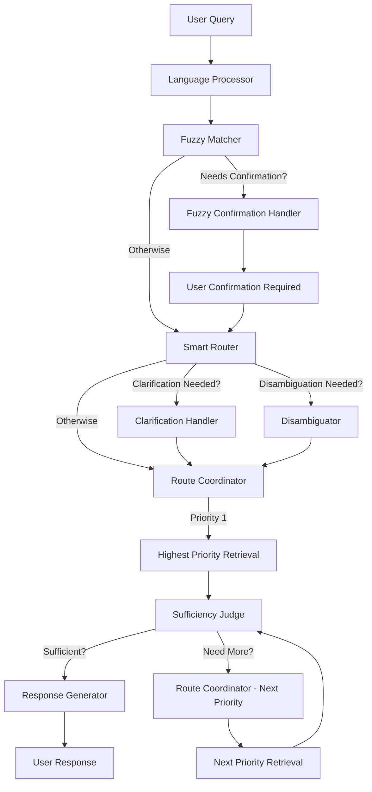

> **This project is licensed under the Apache License 2.0. See the LICENSE file for details.**

# Multi-Agent System for CiteWeave

This folder contains the core logic for the multi-agent system that powers advanced academic query and analysis in CiteWeave. The system is designed for modularity, extensibility, and robust collaboration between specialized agents.

---

## Overview

The multi-agent system orchestrates several specialized agents to handle complex academic queries, including:
- **Language processing and translation**
- **Fuzzy matching and entity confirmation**
- **Intelligent query routing with prioritized retrieval**
- **Information sufficiency assessment**
- **Graph database citation analysis**
- **Vector-based semantic search**
- **PDF/document content analysis**
- **Author-paper index and collection analysis**
- **Clarification and error handling**

### New Features

🆕 **Fuzzy Matching with User Confirmation**: When searching for entities like "麦克尔波特", the system performs fuzzy matching and asks users to confirm which specific person/paper they meant.

🆕 **Prioritized Retrieval with Sufficiency Assessment**: Instead of parallel retrieval, the system prioritizes retrieval methods (e.g., embedding → graph → PDF → author) and uses an AI agent to assess whether retrieved information is sufficient before continuing.

The main entry point is the `EnhancedMultiAgentSystem` class in `multi_agent_system.py`.

---

## Collaboration Workflow

The system uses a workflow engine to coordinate agent collaboration. The typical flow is as follows:



---

## Agent Responsibilities and Logic

| Agent | Responsibility | Key Logic |
|-------|---------------|-----------|
| **Language Processor** | Detect language and translate to English for internal processing | Multi-language support with translation tracking |
| **🆕 Fuzzy Matcher** | Find fuzzy matches for entities and generate confirmation questions | Uses author index and vector search for similarity matching |
| **Smart Router** | Analyze query and determine retrieval priorities | AI-powered routing with priority ordering |
| **Paper Disambiguator** | Handle paper disambiguation and search | Search for papers based on entities |
| **Route Coordinator** | Manage prioritized retrieval execution | Sequential priority-based retrieval instead of parallel |
| **🆕 Sufficiency Judge** | Assess if retrieved information is sufficient | AI-powered assessment with detailed explanation |
| **Graph Citation Analyzer** | Extract citation relationships from graph database | Citation analysis and concept mentions |
| **Vector Concept Searcher** | Semantic search using vector embeddings | Concept definitions and semantic similarity |
| **PDF Content Analyzer** | Analyze full document content | Document summary and content analysis |
| **Author Collection Handler** | Process author-specific queries | Author paper collections and metadata |
| **Response Generator** | Generate final responses | Multi-format response generation with translation |
| **Clarification Handler** | Generate clarification questions | Context-aware clarification with conversation memory |
| **🆕 Fuzzy Confirmation Handler** | Handle fuzzy match confirmations | User confirmation workflow for ambiguous entities |

### Detailed Workflow Changes

#### 1. Fuzzy Matching Workflow
```
User Query: "麦克尔波特" 
→ Fuzzy Matcher detects no exact match
→ Finds candidates: ["Michael Porter", "Michael E. Porter", "M. Porter"]
→ Generates confirmation question in user language
→ Waits for user selection
→ Updates entities with confirmed choice
→ Continues to Smart Router
```

#### 2. Prioritized Retrieval Workflow
```
Query: "What are Porter's key concepts?"
→ Smart Router determines priorities: [embedding_vector, author_index, pdf_content, graph_database]
→ Route Coordinator executes Priority 1 (embedding_vector)
→ Sufficiency Judge: "Information insufficient - missing comprehensive author overview"
→ Route Coordinator executes Priority 2 (author_index)
→ Sufficiency Judge: "Information sufficient for comprehensive answer"
→ Response Generator creates final response
```

Below is a summary of each agent in the system, including its responsibility, decision logic, and output:

| Agent Name                | Responsibility                                                                 | Decision Logic / Criteria                                                                                 | Output / Result                                      |
|--------------------------|-------------------------------------------------------------------------------|----------------------------------------------------------------------------------------------------------|------------------------------------------------------|
| **Language Processor**    | Detects user query language, translates to English if needed                  | Heuristic/LLM-based language detection; translates if not English                                         | English query, detected language, translation flag   |
| **Smart Router**          | Analyzes query intent, determines which agents/data sources are needed        | LLM-based entity extraction and routing; pattern matching as fallback                                     | List of required agent routes                        |
| **Clarification Handler** | Generates clarification questions if query is ambiguous or lacks information  | Checks for missing/ambiguous entities, low confidence, or too many/too few results                        | Clarification question (string)                      |
| **Disambiguator**         | Resolves ambiguous paper/author references                                   | Looks up papers/authors by extracted entities; checks for multiple/zero matches                           | Candidate/selected papers, disambiguation flag       |
| **Route Coordinator**     | Manages execution of required agent routes, tracks completion                 | Checks which routes are pending/completed; dispatches next agent(s)                                       | Updated state, triggers agent execution              |
| **Graph Citation Analyzer** | Analyzes citation relationships and concepts using the graph database        | Uses selected/candidate papers and query type; determines citation direction                              | Citation relationships, concept mentions             |
| **Vector Concept Searcher** | Performs semantic search and concept definition using vector database        | Uses processed query; determines granularity and search scope                                             | List of relevant semantic results                    |
| **PDF Content Analyzer**  | Analyzes the content of specific papers using PDF and LLM                    | Finds PDF paths for selected papers; uses LLM for summarization/analysis                                  | PDF content analysis (string/summary)                |
| **Author Collection Handler** | Analyzes all works by an author, provides comprehensive author analysis    | Looks up all papers by author; uses LLM for summary if PDFs available, else metadata-only                 | Author collection analysis (string/summary)          |
| **Response Generator**    | Synthesizes results from all agents, generates final user response           | Combines outputs from all routes; uses LLM for structured, comprehensive response                         | Final response string, confidence score              |

**Notes:**
- Each agent is implemented as an async method in `multi_agent_system.py`.
- The workflow engine coordinates agent execution and state transitions.
- Agents may run in parallel or sequentially depending on the query and required data sources.

---

## Usage Example

You can use the multi-agent system as follows (see also the `__main__` block in `multi_agent_system.py`):

```python
from src.graph_builder import GraphDB
from src.vector_indexer import MultiLevelVectorIndexer
from src.author_paper_index import AuthorPaperIndex
from src.agents.multi_agent_system import EnhancedMultiAgentSystem

# Initialize dependencies (see __main__ for full example)
graph_db = GraphDB(uri, user, password)
vector_indexer = MultiLevelVectorIndexer(paper_root, index_path)
author_index = AuthorPaperIndex(storage_root, index_db_path)

agent_system = EnhancedMultiAgentSystem(
    graph_db=graph_db,
    vector_indexer=vector_indexer,
    author_index=author_index,
    config_path="config/model_config.json"
)

# Run a query
import asyncio
result = asyncio.run(agent_system.query(
    user_query="What is competitive strategy?",
    thread_id="example_thread",
    user_id="example_user"
))
print(result["response"])
```

---

## Exposed Interfaces

- **`EnhancedMultiAgentSystem.query(user_query, thread_id, user_id)`**: Main async interface for querying the system.
- **`EnhancedMultiAgentSystem.query_sync(user_query, thread_id, user_id)`**: Synchronous wrapper for quick testing.

---

## Extending the System

- To add a new agent, implement the agent logic as an async method in `multi_agent_system.py` and add it to the workflow in `_build_workflow()`.
- Update the smart router logic to route relevant queries to your new agent.
- Ensure your agent returns results in the expected format for response synthesis.

---

## Directory Structure

```
src/agents/
  multi_agent_system.py   # Main multi-agent system logic and workflow
  README.md              # This documentation
```

Other supporting modules (graph, vector, author index, LLM manager) are in `src/`.

---

## Key Dependencies
- [LangGraph](https://github.com/langchain-ai/langgraph) (workflow engine)
- [LangChain](https://github.com/langchain-ai/langchain) (LLM orchestration)
- Neo4j (graph database)
- Qdrant (vector database)
- SentenceTransformers (embeddings)

---

## Contact & Contribution

For questions or contributions, please open an issue or pull request on the project repository. 